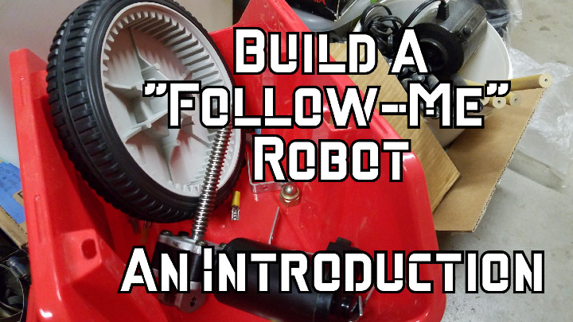
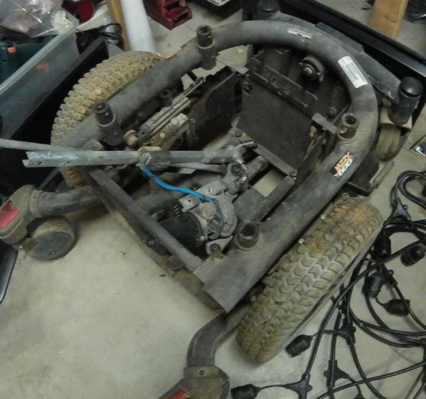
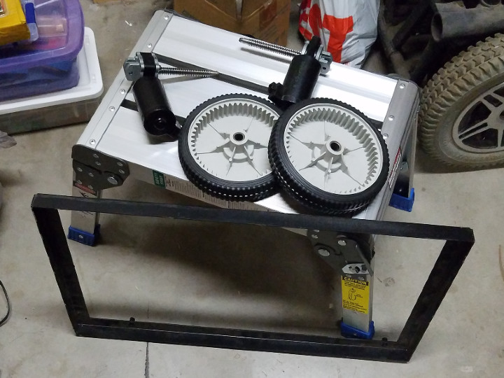
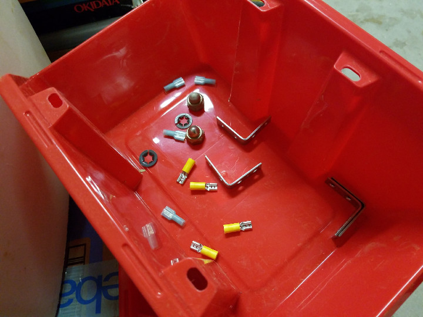
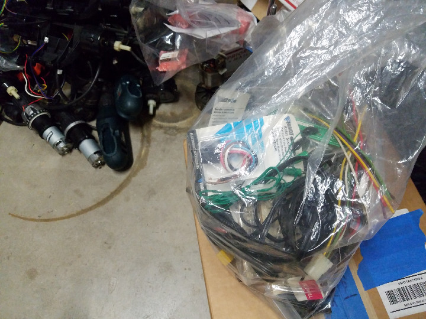

# Build a "Follow-Me" Robot

Check out the latest on this project and tutorial at the [Junkbotix Channel](https://www.youtube.com/channel/UCNxQ47xBEYjD-mey_lxj9Aw) on Youtube!

 

## The Idea / Concept

I had long thought of building something like this to carry tools and parts for me, when I would go to a "u-pull-it" automobile junkyard. I had wanted to build it using an electric mobility chair base I own:

So I was pleasantly surprised when one day I encountered [this project on Hackster.io](https://www.hackster.io/hackershack/make-an-autonomous-follow-me-cooler-7ca8bc)

They called it a "Follow Me Cooler", and I was skeptical from the start that the implementation, as described, could work. If it did work, I thought it would work poorly at best. The motors and drivers seemed completely inadequate for the task of carrying a cooler full of ice and drinks, except maybe on very flat surfaces. Still, the idea had merit; it just needed a few tweaks and updates.

It seemed like people had tried to build the project, to varying levels of success: I'm honestly not sure if anybody got it to work beyond the authors. I attempted to answer and help various people in the discussion, but it always bothered me that the original authors of the project seemed to have quickly abandoned those who wanted to build a version of it themselves, and had questions about how to make it work. To be fair, they did answer questions initially...

Now, you can certainly give their project an attempt, and if you get anything working with it, please let me know. I'd love to hear about your experience!

But I want to approach the project virtually "from scratch", without using the Hackster.io project as anything more than an inspiration. I want to show how to build a real working implementation, using properly sized motors, motor drivers, and other components, along with working software that doesn't rely on an outside third-party (like Blynk) to operate.

Because of this goal, I won't be using the wheelchair base, either, because most people probably can't easily get ahold of one, plus it's more expensive to implement (the batteries alone cost over $120.00 USD). But the underlying concepts and everything else could certainly be used with such a base, if you have one.

In fact, while I show how to build a base, there's nothing that says you couldn't use, for instance, a version of the [Toy RC Car Robot Platform](https://github.com/junkbotix/toy-rc-car-robot-platform) for the project. This robot doesn't have to carry anything, it could simply be built to follow you around...like a lost puppy.

 

The method to implement such a robot, at the basic level, is fairly simple:

1. The user of the robot carries a means to identify her current location.
2. The robot also carries a means to identify its location.
3. The user transmits to the robot her location coordinates.
4. The robot compares those coordinates to its own location.
5. If the difference in coordinates deviates by a certain percentage, then the robot knows it needs to move close to the user.
6. The robot picks a heading and accellerates toward the user, stopping when it is no longer "out of range".

 

## The Robot Base

The base of this robot will be constructed from relatively easy to get parts, most or all of which can be found as junk. What I'll be using is a mix of surplus parts I had purchased in the past, along with bits and pieces scavenged elsewhere.

We'll be starting off with a pair of surplus automobile seat motors, mounting one of these lawnmower wheels to the shaft of each motor, then mounting the motors to this rectangular base. We'll also have a pair of casters to balance things out, and some kind of flat platform for whatever you're carrying to sit on (the classic example being a beverage cooler).

These parts (inside the red bin) are mainly for hooking up power to the motors, and for transmitting that power to the wheels. I know it looks a bit "random", but trust me, these all have a purpose in the build...

Some of this stuff in this "bag-o-wires" may come into the picture, too. My thoughts on this project are not completely concrete, but as I build the project and create my videos for the tutorial, I'll explain what I'm using and doing...

## Implementation Details

For our simple implementation, the user and the robot will use GPS receivers as their means of knowing their (respective) positions. The user's GPS receiver will be their phone. The robot will have bluetooth and/or wifi (in theory, it could also have its own cell phone or similar device).

The robot and the user's phone will communicate with each other via bluetooth and/or wifi; the robot can query for the GPS coordinates of the user, and the user's phone will send back its coordinates. Alternatively, the robot could send it's location to the user's phone, and the phone could then do the calculations, and send the heading and distance info to travel back to the robot. Either method could be made to work, and which you decide to use may depend on what kind of processing power you have on the robot, versus what is available on the phone.

A simple distance and heading calculation/selection is performed, and the robot is commanded to move appropriately.

 

## Caveats

1. In this simple example, there's no provision for obstacle avoidance...
2. ...there's also no provision for mapping the local environment.
3. Which means the robot could get stuck against an obstacle...
4. ...or it could run the obstacle over...or collide with it...or...?
5. Doing such avoidance, mapping, planning of a path...is outside our scope.
6. It's also a "non-trivial" problem - and one that needs more exploration.

I won't be exploring these "hard details". I will leave that to my viewers. Such details go well beyond the foundations and scope of Junkbotix. But if you manage to take things that far, I'd love to hear and know more about your success! If you are curious, though, check out the topics below under "Further Research".

 

## Further Research

* SLAM
* Localization
* Mapping
* Path Planning
* A*Star