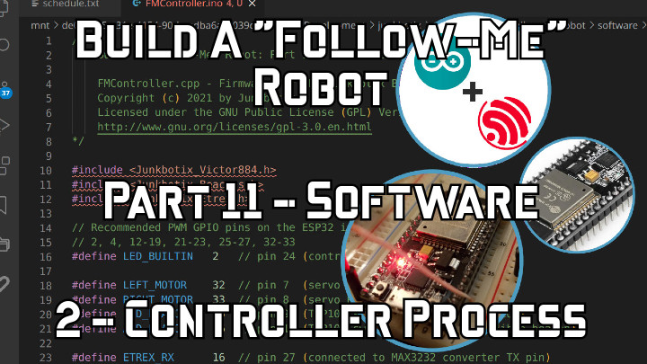

 

## Watch now on YouTube:

Check out the latest on this project and other tutorials at the [Junkbotix Channel](https://www.youtube.com/channel/UCNxQ47xBEYjD-mey_lxj9Aw) on Youtube!

 

## Quicklinks

* [Introduction](./introduction)
* [Part 1 - Theory of Operation](./theory-of-operation)
* [Part 2 - Selecting Your Motors and Batteries](./motors-and-batteries)
* [Part 3 - Controlling Your Motors](./motor-control)
* Chassis Assembly
  * [Part 4 - Drive Motors (and Wheels)](./chassis-assembly/drive-motors)
  * [Part 5 - Frame and Deck](./chassis-assembly/frame)
  * [Part 6 & 7 - Motor Mounting](./chassis-assembly/motor-mounting)
  * [Part 8 - Caster Wheels](./chassis-assembly/caster-wheels)
  * [Completed Chassis](./chassis-assembly/completed)
* [Part 9 - Chassis Electrical](./chassis-electrical)
  * [Layout](./chassis-electrical/layout)
  * [Parts](./chassis-electrical/parts)
    * [Battery](./chassis-electrical/parts/battery)
    * [Breaker and Fuses](./chassis-electrical/parts/fuses)
    * [Switches](./chassis-electrical/parts/switches)
    * [Indicators](./chassis-electrical/parts/indicators)
    * [Motor Controllers](./chassis-electrical/parts/motor-controllers)
  * [Mechanical](./chassis-electrical/mechanical)
    * [Panel](./chassis-electrical/mechanical/panel)
    * [Enclosure](./chassis-electrical/mechanical/enclosure)
    * [Beacon Pole](./chassis-electrical/mechanical/beacon-pole)
    * [Battery Strap](./chassis-electrical/mechanical/battery-strap)
  * [Wiring](./chassis-electrical/wiring)
* Part 10 - Controller and Basic Sensors
  * [Controller](./controller)
    * [Piggy-back Enclosure](./controller/enclosure)
    * [Additional Files](./controller/files)
  * [GPS](./gps)
    * [MAX232 Level Converter](./gps/max232)
    * [Garmin Etrex Custom Interface Cable](./gps/interface-cable)
    * [Additional Files](./gps/files)
  * [Safety Beacons](./safety-beacons)
* [Part 11 - Software](./software) (!!! WIP !!!)
  * [Code for ESP32](./software/esp32)
    * [State Machine Outline](./software/esp32/files/STATE-MACHINE-OUTLINE.md) - Basic outline for the firmware state machine process
    * [FMController](./software/esp32/FMController) - Base controller firmware
    * [Libraries](./software/esp32/libraries) - Custom support libraries
      * [Junkbotix_Beacons](./software/esp32/libraries/Junkbotix_Beacons) - Interface library for LED and audible beacons
      * [Junkbotix_Client](./software/esp32/libraries/Junkbotix_Client) - Class to model the client
      * [Junkbotix_Common](./software/esp32/libraries/Junkbotix_Common) - Common library/class structures, defines, etc
      * [Junkbotix_Comms](./software/esp32/libraries/Junkbotix_Comms) - Serial and web communications library
      * [Junkbotix_Etrex](./software/esp32/libraries/Junkbotix_Etrex) - Interface library for the Garmin Etrex GPS (serial)
      * [Junkbotix_Nav](./software/esp32/libraries/Junkbotix_Nav) - Navigation library
      * [Junkbotix_Planner](./software/esp32/libraries/Junkbotix_Planner) - Route planner library
      * [Junkbotix_Robot](./software/esp32/libraries/Junkbotix_Robot) - Class to model the robot
      * [Junkbotix_Victor884](./software/esp32/libraries/Junkbotix_Victor884) - Interface library for Victor-884 motor controllers
      * [Junkbotix_Webserver](./software/esp32/libraries/Junkbotix_Webserver) - Web server library
    * [Test Code](./software/esp32/tests) - Various prototype test code
      * [Flasher](./software/esp32/tests/flasher)
      * [Sweep Servo Test](./software/esp32/tests/sweep-servo-test)
      * [GPS Serial Test](./software/esp32/tests/gps-serial-test)
      * [Beacons and Motors Test](./software/esp32/tests/beacons-motors-test)
      * [Ping-Pong Async Web Server Test](./software/esp32/tests/pingpong-asyncwebserver-test)

 

## License

Unless otherwise specified, all code is licensed as [GPLv3](http://www.gnu.org/licenses/gpl-3.0.en.html) and is Copyright (c) 2021 by Junkbotix

See the [`LICENSE.md`](./LICENSE.md) file for more information.

* If you wish to make a pull request against this repo, go for it, just know that any such request may or may not be used...
* I make no guarantees that any of the code will compile properly or work at all!
* I take no responsibility for your use or misuse of any of this code!
* Caveat emptor!