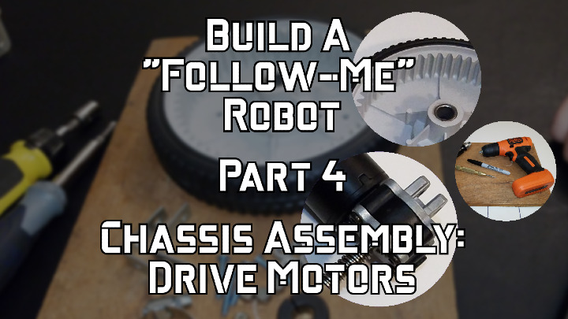

 

Check out the latest on this project and other tutorials at the [Junkbotix Channel](https://www.youtube.com/channel/UCNxQ47xBEYjD-mey_lxj9Aw) on Youtube!

 

## Quicklinks

* [Introduction](./introduction)
* [Part 1 - Theory of Operation](./theory-of-operation)
* [Part 2 - Selecting Your Motors and Batteries](./motors-and-batteries)
* [Part 3 - Controlling Your Motors](./motor-control)
* Chassis Assembly
  * [Part 4 - Drive Motors (and Wheels)](./chassis-assembly/drive-motors)