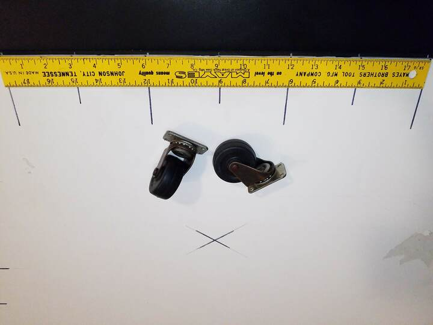
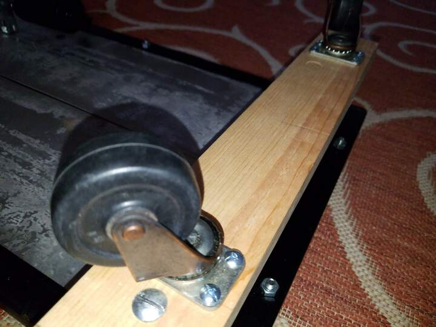
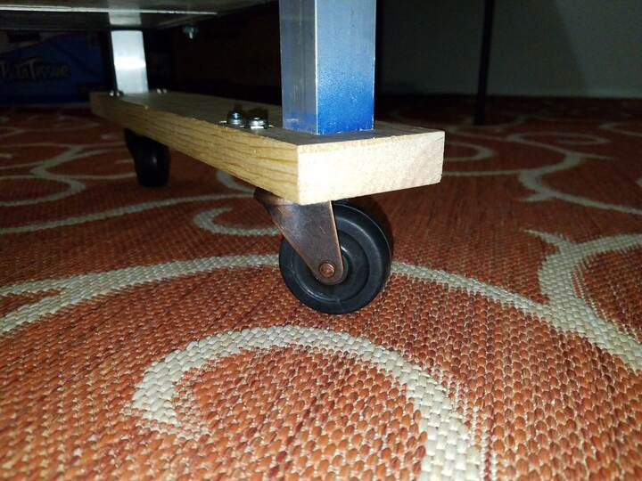
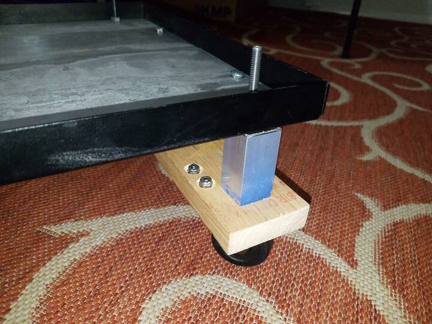

 

Check out the latest on this project and other tutorials at the [Junkbotix Channel](https://www.youtube.com/channel/UCNxQ47xBEYjD-mey_lxj9Aw) on Youtube!

 

## Fabricating the Caster Wheel Support

These are the set of basic casters I'm using to support the front-end of my "follow-me" robot chassis:

They're made of solid rubber, with a robust metal frame. I'm not sure where they came from, just another piece of junk I had sitting in a box on a shelf in my shop. They're also of much better quality than the standard plastic office chair casters I have plenty of (which are more suitable for indoor flat-surface robots only).

 

Unfortunately, while they'll work, they are actually a bit too small. So I needed to make a "support" to raise the chassis above the level of the caster mounting plate so that the chassis would ride level. The support need to add 3 inches of "lift" to level the chassis.

Heck yeah, I put a lift on my robot...

 

## The Support Platform

I used a piece of wood I had, that was 3/4 inches thick, so I needed to make a set of "standoffs" 2-1/4" thick, for each end of the board. I fabricated them out of 1 inch square aluminium extrusion. These parts, along with some customized 1/4-20 carriage bolts (see the video) made a sturdy platform on which to mount the casters, using some slightly smaller nuts and bolts:

 
 

## Aluminum "Standoffs"

&nbsp;&nbsp;&nbsp;&nbsp;

 

As you can see, the carriage bolts were threaded through the rivnuts on the frame. The wood platform also looks like it could be used to support additional sensors...

In the future, though, I might just switch these casters out with some larger ones, if I happen upon any.