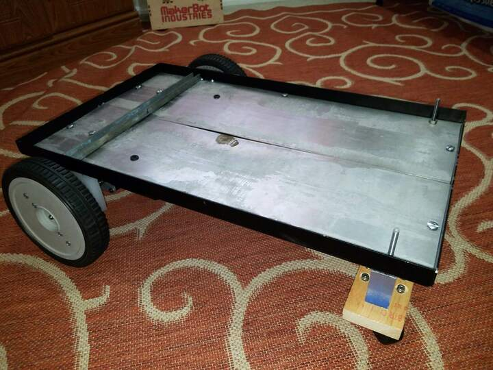
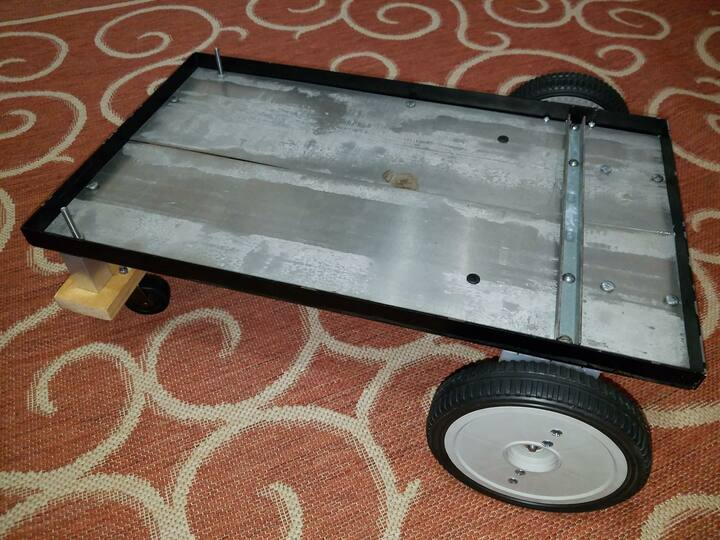
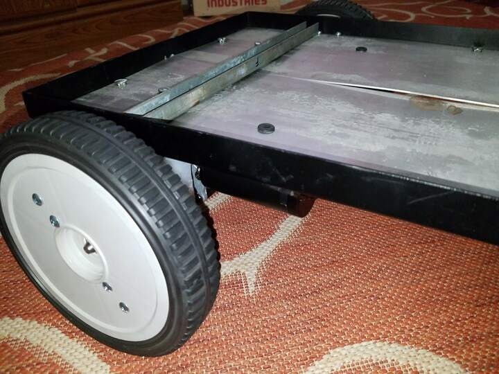
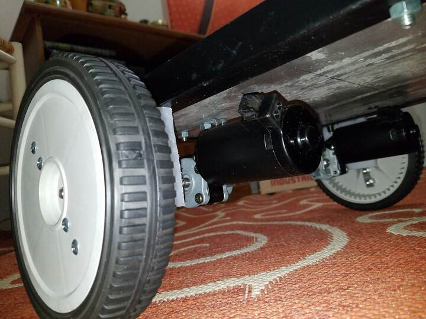
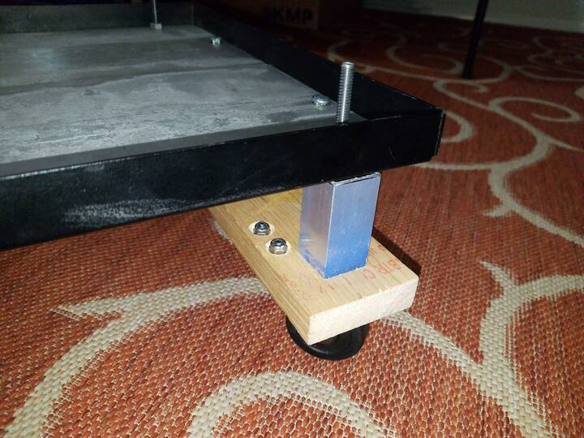
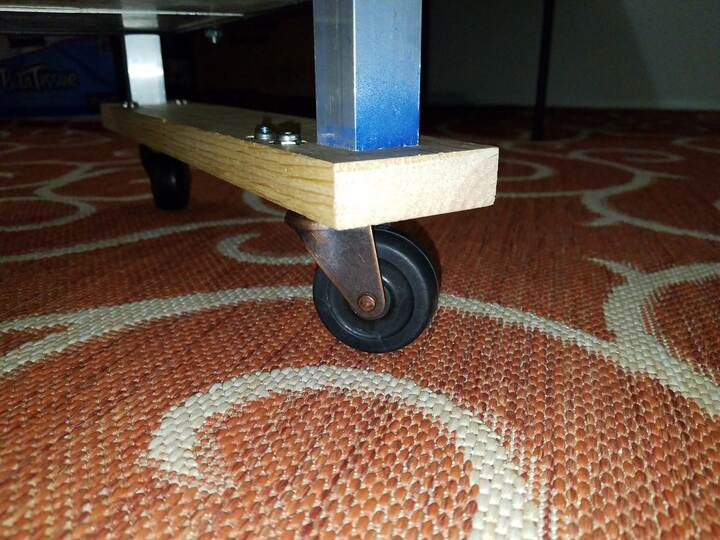

 

Check out the latest on this project and other tutorials at the [Junkbotix Channel](https://www.youtube.com/channel/UCNxQ47xBEYjD-mey_lxj9Aw) on Youtube!

 

## The (mostly) Completed Chassis

&nbsp;&nbsp;&nbsp;&nbsp;

&nbsp;&nbsp;&nbsp;&nbsp;

&nbsp;&nbsp;&nbsp;&nbsp;

I call it "mostly completed" because there's still a few bits and bobs and things that need to be added, which could possibly be considered part of the chassis. It's really a judgement call, though. I'm opting to put those parts into later sections of this tutorial as they are needed.

What you see here is the completed fabrication of a fairly basic, but robust robot chassis that could be used for a variety of different experimental purposes, not just as a "follow-me" robot. I'm fairly pleased with this creation.

 

## Additional Work? Yep...

Things left to do to this chassis:

  1. I'm not sure if I want to clean things up and paint it, or leave junky as-is - maybe that might be a "post-tutorial" thing?
  2. Trim off those extended bolt threads.
  3. Blue loctite where needed...
  4. ...Nylock nuts everywhere else.
  5. Install clips on wheels.