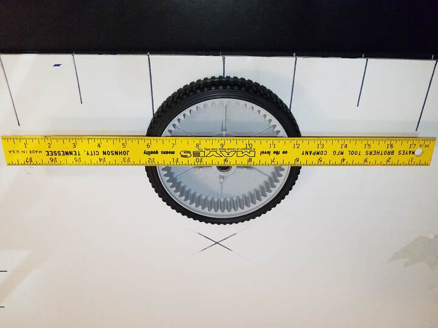
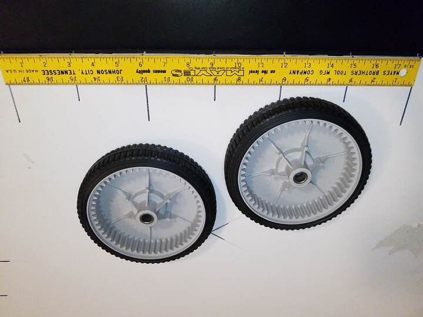
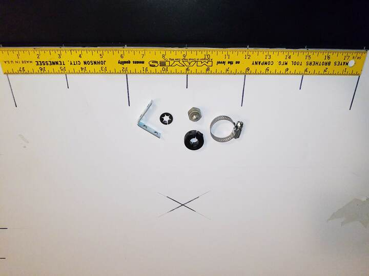
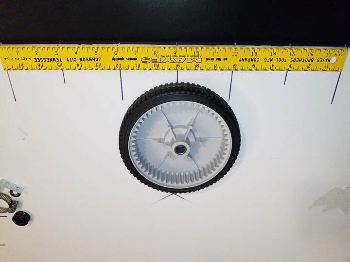
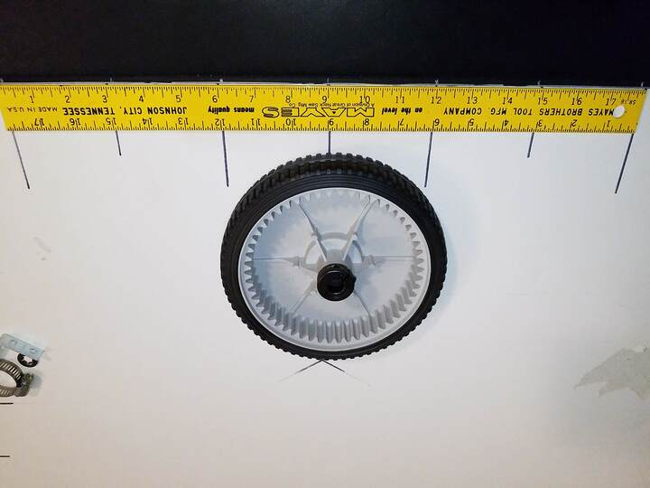
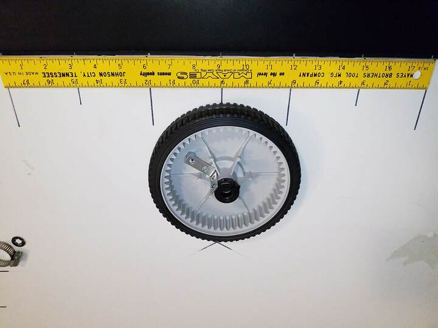
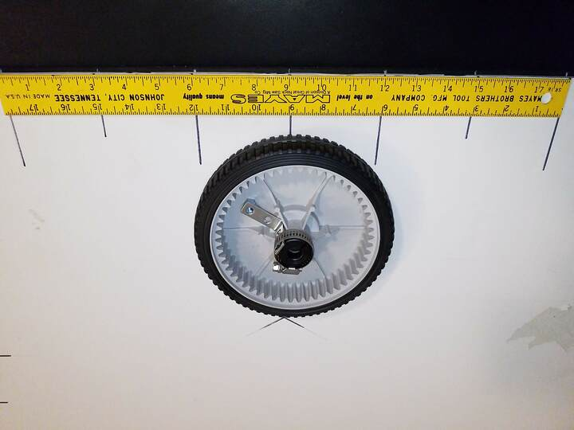
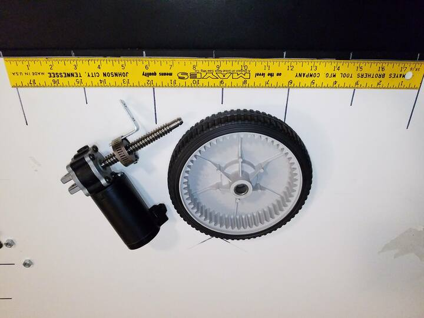
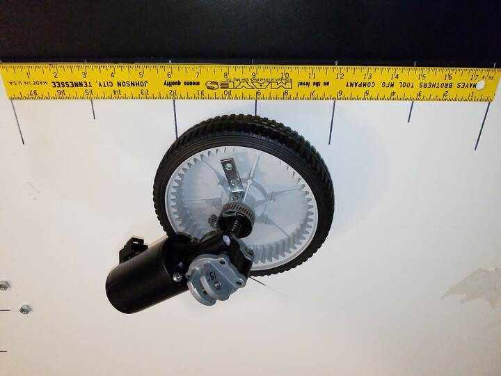
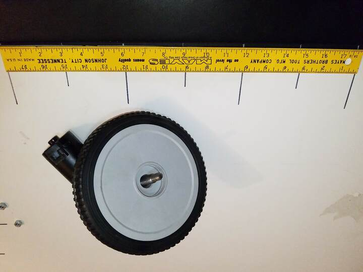

 

Check out the latest on this project and other tutorials at the [Junkbotix Channel](https://www.youtube.com/channel/UCNxQ47xBEYjD-mey_lxj9Aw) on Youtube!

 

## About the GM Delco 5503740 Gearmotor

I'm using these gearmotors for my "follow-me" robot platform because I've found them to be almost the perfect drive motor for hobbyist robotics. They are inexpensive, easy to modify into left and right-hand orientation (of the shaft), and have excellent torque and speed characteristics.

 

## Specifications

It should be noted that these specifications are a combination of various vendor specs, along with other third-party measurements. While I can't claim to say they are 100% accurate, I do believe they are as close as one can get, since the real specs are virtually unpublished.

* P/N 5503740, (alt: 200683N)
* 6/12/24 VDC
* 1.5A no load, 17A/25A stall @ 12V
* 88/178/380 RPM (190 rpm?) - no load
* 1/3 HP (12VDC * 25A = 300W; 300W / 746W/HP = ~0.4HP) 
* Available in Right Hand (SK1640) or Left Hand(SK1641) configurations

 

## Dimensions

* .187 male quick connect terminals
* 4-1/8 in long 7/16-8 modified class 4G single start ACME leadscrew
* Heavy gauge U-bracket on back of gearhead, 2x 1/4" holes with 7mm spacing.
* L: 5-1/2"  H: 2-1/4"  H:6"  WT: 1.8 lbs
* Motor: Overall length, 144mm (5.66"); Diameter 49mm (1.91") 
* Worm Shaft: 12mm diameter x 89mm (3.55") long
  Thread: 7/16"-8 (right-hand twist) 
* Output shaft diameter (to threads):
     - 7/16" (0.4375in); measured 0.46in, 11.8mm
     - 15/32" (0.469), 12mm
* Output shaft diameter (narrowest) - measured 0.34in, 8.7mm
* 5/16" e-clip (end of shaft)

 

## More Information

* [gm-delco-5503740-gearmotor.zip](./files/gm-delco-5503740-gearmotor.zip)

 

## About the Wheels

&nbsp;&nbsp;&nbsp;&nbsp;

The wheels I am using came from a surplus purchase I made several years ago. They were meant to replace the driving wheels of some particular model of lawnmower; you can see the inner ring gear meant for this purpose, molded into the inner rim of each wheel.

Each one measures approximated 7 inches in diameter, and has a hub with a press-fit sleeve bearing. 6 and 7 inch diameter wheels of this type can be found at just about any hardware store, brand new. Or you can salvage a pair from an old lawnmower. Just make sure the plastic rim is in sound shape, as they can become brittle from exposure to the sun.

 

## How the Wheels Are Mounted

The following images should illustrate the process by which a wheel will be mounted to the motor shaft. This is just an example of one way to do this; your own motors or wheels may need something different.

 

## 1. Wheel mounting parts

These parts are shown above, from left-to-right:

* Hose clamp
* Shaft collar
* Acorn nut
* Split snap-ring
* L-bracket

 

## 2. The wheel

The wheel being used doesn't lend itself to being able to be attached to the motor easily, as it was never designed for that use. Instead, it was meant to ride on a static shaft via it's sleeve bearing, and geared to its original power source via the ring gear molded on the inner rim.

 

## 3. Shaft Collar

The shaft collar will be clamped to the output shaft of the gearmotor. It is split in such a manner that it can be slipped over the end of the shaft, positioned properly, then a screw is tightened down and the clamping force is distributed around the shaft of the motor.

 

## 4. Shaft Collar with L-Bracket

The L-brackets (2 per wheel; in these pictures, only one L-bracket is shown for clarity) will be mounted to the wheels, 180 degrees opposite to each other. The L-bracket is positioned so that one leg extends past the "inner hub" of the wheel, and the wheel will be drilled to allow bolts to fasten the bracket to the wheel. A spacer nut on one end of the L-bracket will help to support it, similar to the picture.

 

## 5. Shaft Collar with L-Bracket and Hose Clamp

The L-bracket will then be clamped to the shaft collar using the hose clamp...

 

...and the shaft collar will tightened and clamped to the output shaft of the gear motor.

 

In this way, the motor can transfer torque to the wheels, without needing to use any kind of uncommonly owned tools (such as a welder) for fabrication. 

 

Note the gap between the outer diameter of the shaft and the inner diameter of the hub. The acorn nut will be modified using a hacksaw and file to become a bushing to support the wheel at the end of the drive shaft, and the snap-ring will be fitted to the end of the driveshaft (which has a groove machined in it) to keep the custom bushing in place.