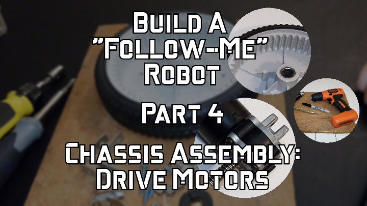
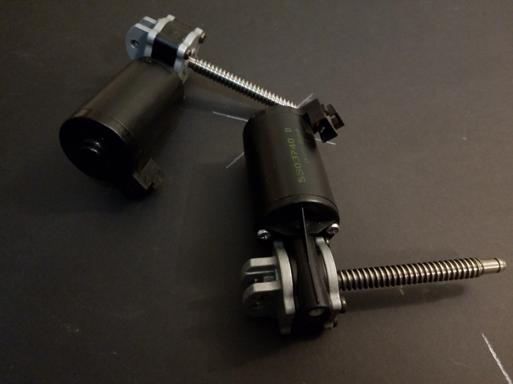
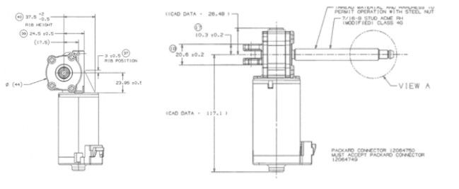

 

Check out the latest on this project and other tutorials at the [Junkbotix Channel](https://www.youtube.com/channel/UCNxQ47xBEYjD-mey_lxj9Aw) on Youtube!

 

## About the GM Delco 5503740 Gearmotor

I'm using these gearmotors for my "follow-me" robot platform because I've found them to be almost the perfect drive motor for hobbyist robotics. They are inexpensive, easy to modify into left and right-hand orientation (of the shaft), and have excellent torque and speed characteristics.

 

## Specifications

It should be noted that these specifications are a combination of various vendor specs, along with other third-party measurements. While I can't claim to say they are 100% accurate, I do believe they are as close as one can get, since the real specs are virtually unpublished.

* P/N 5503740, (alt: 200683N)
* 6/12/24 VDC
* 1.5A no load, 17A/25A stall @ 12V
* 88/178/380 RPM (190 rpm?) - no load
* 1/3 HP (12VDC * 25A = 300W; 300W / 746W/HP = ~0.4HP) 
* Available in Right Hand (SK1640) or Left Hand(SK1641) configurations

 

## Dimensions

* .187 male quick connect terminals
* 4-1/8 in long 7/16-8 modified class 4G single start ACME leadscrew
* Heavy gauge U-bracket on back of gearhead, 2x 1/4" holes with 7mm spacing.
* L: 5-1/2"  H: 2-1/4"  H:6"  WT: 1.8 lbs
* Motor: Overall length, 144mm (5.66"); Diameter 49mm (1.91") 
* Worm Shaft: 12mm diameter x 89mm (3.55") long
  Thread: 7/16"-8 (right-hand twist) 
* Output shaft diameter (to threads):
     - 7/16" (0.4375in); measured 0.46in, 11.8mm
     - 15/32" (0.469), 12mm
* Output shaft diameter (narrowest) - measured 0.34in, 8.7mm
* 5/16" e-clip (end of shaft)

 

## More Information

* [gm-delco-5503740-gearmotor.zip](./files/gm-delco-5503740-gearmotor.zip)