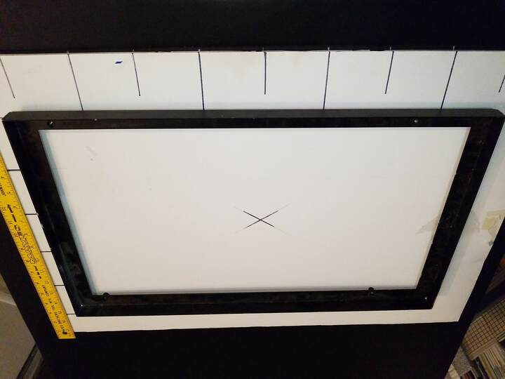
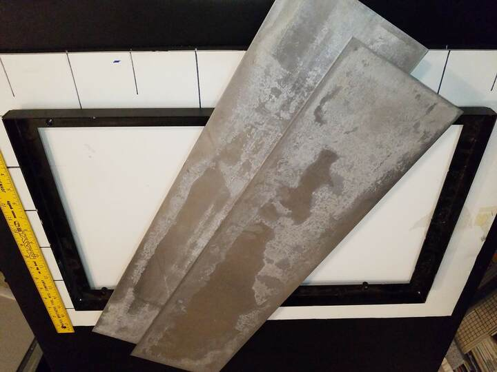
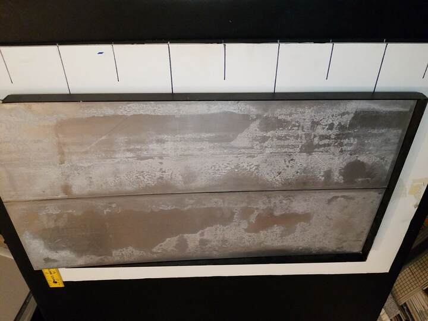

 

Check out the latest on this project and other tutorials at the [Junkbotix Channel](https://www.youtube.com/channel/UCNxQ47xBEYjD-mey_lxj9Aw) on Youtube!

 

## Frame Fabrication

There's really not much I can post about here, because everybody's robot frame will be different, and have a different purpose. Probably the best resource to consult on building a robot's frame would be Gordon McComb's book, "The Robot Builder's Bonanza":

* First Edition (ISBN 0-8306-2800-2)
  * See Chapters 5-7 (p31-51) and 15-17 (p126-152)
* Second Edition (ISBN 0-07-136296-7)
  * See Chapters 8-10 (p101-132) and 21-23 (p321-370)
* Third Edition, with Myke Predko (ISBN 0-07-146893-5)
  * See Chapters 8-10 (p97-130) and 23-25 (417-463)
* Fourth Edition (ISBN 978-0-07-175036-3)
  * See Chapters 5-15 (p49-159), 17 (170-176), 26-27 (297-338)

Regarding this series of books, I encourage you to get every edition. While the first edition contains material that may not be as useful today, later editions remove certain information that I believe is still relevant (while adding a lot more information that is also worthwhile). The nature of publishing and authorship. But it is a seriously good book on hobbyist robotics, so grab whatever edition you can get your hands on, as there's a ton of material inside beyond building a robot chassis.

 

## My Frame

This frame was found in the trash - literally. I have no idea what it belonged to originally, but since my friend does dental equipment repair, I can only surmise that it comes from such a piece of equipment. It measures 24 inches long by 14 inches wide, and has four handy 1/4-20 inch rivnuts already installed. Perfect!

 

## Deck Materials

The deck of the chassis will be made using these thin pieces of aluminium sheet metal, which I picked up as surplus some time ago from ARE (Apache Reclamation and Electronics, a local haunt of mine).

 

Amazingly, they fit side-by-side inside the frame almost perfectly! I will need to trim off some of the excess material from the ends to make them properly fit, though.

 

## My Robot's Frame - Technical Specs

* Fabricated from bits and pieces of junk and scrap and stuff, from my pile!
* Rectangular frame is made of some kind of angle steel (I pulled it from my friend's trash can - thanks, Lance!)
* Two pieces of aluminium sheet, cut to fit (surplus from Apache Reclamation)
* Motor support bar is also steel (it used to be part of an automobile windshield wiper assembly)
* Motor support angle brackets - steel, 2-3/4" (I purchased them "new" a long time ago for a forgotten project)
* The majority of fastener hardware is 1/4"-20 standard (there are some smaller bits used in places)
* Length: 24"
* Width: 14"
* Weight: TBD