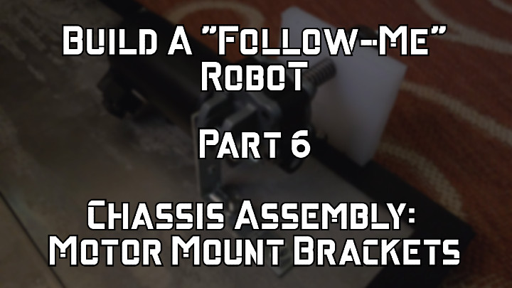
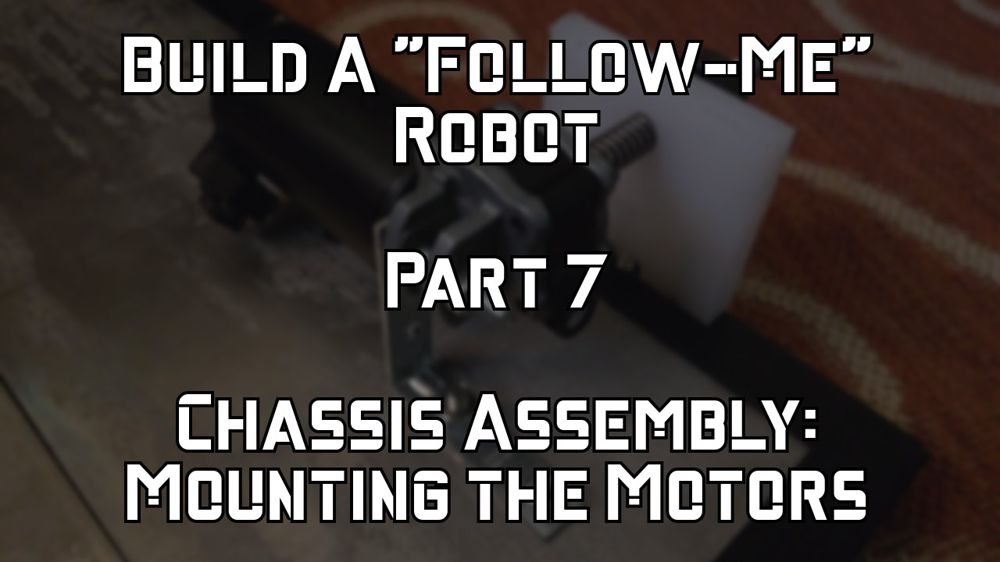
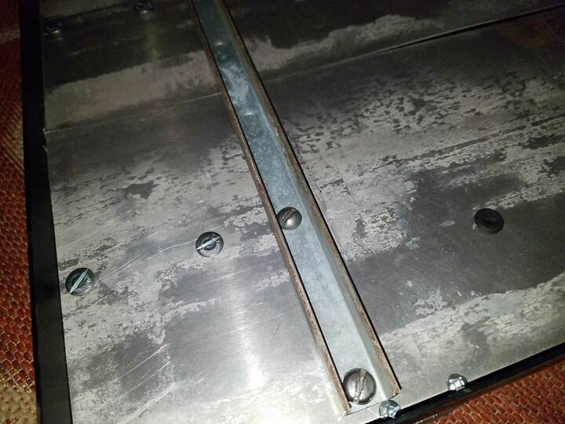
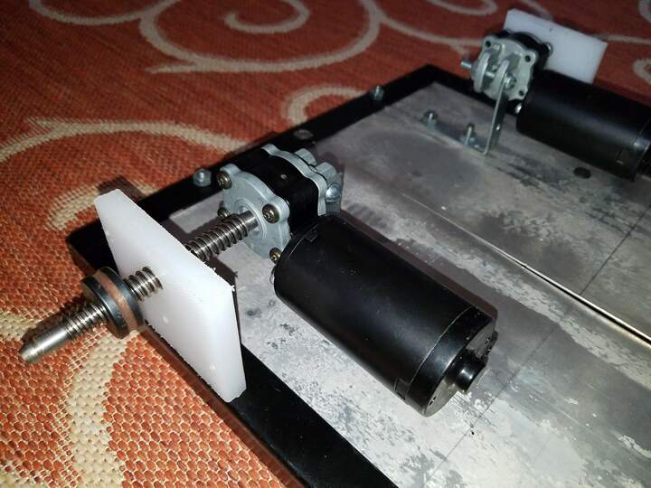
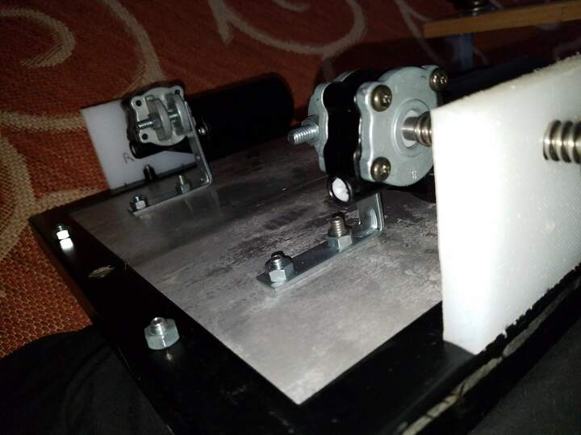
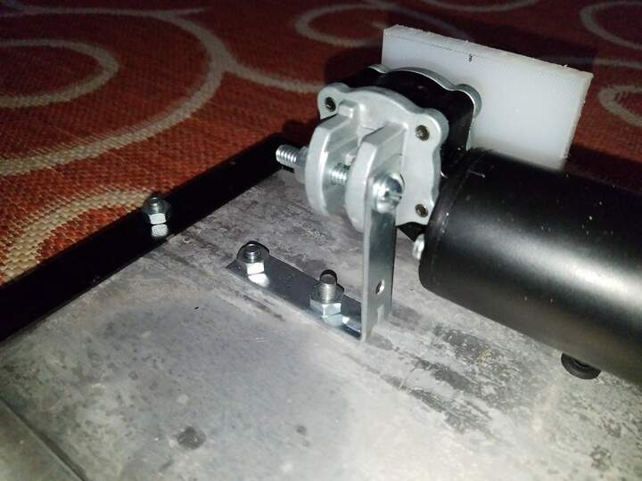
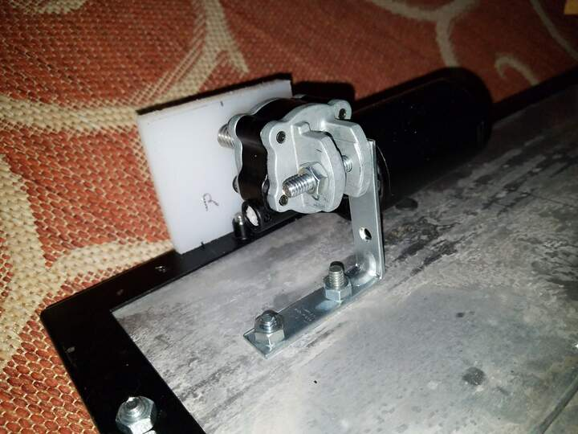
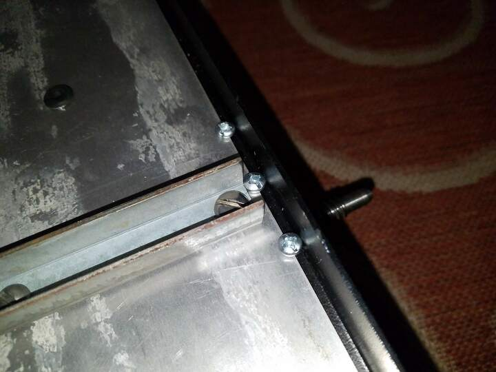
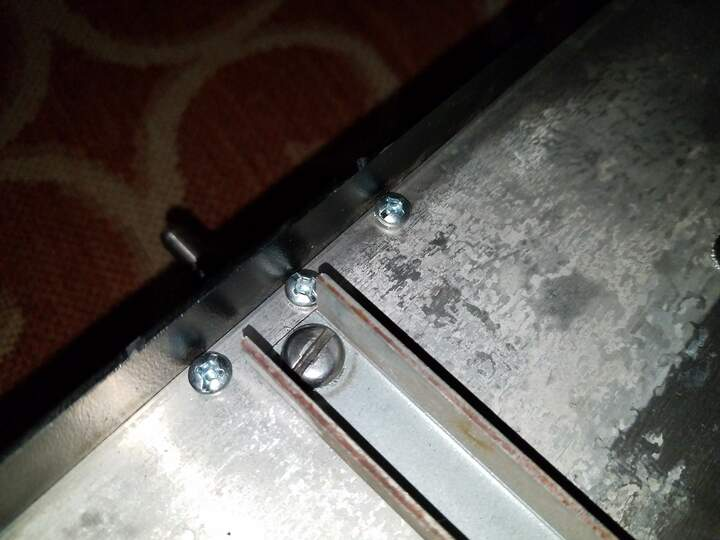

 

&nbsp;&nbsp;&nbsp;&nbsp;

Check out the latest on this project and other tutorials at the [Junkbotix Channel](https://www.youtube.com/channel/UCNxQ47xBEYjD-mey_lxj9Aw) on Youtube!

 

## Supporting the Motors

By itself, the frame and the deck have little support for where the motors are mounted. The sheet aluminium of the deck isn't strong enough to support the weight of the robot, batteries, and the carried load, without it buckling. So I had to fabricate a support bar:

This bar used to be a part of an automobile wiper assembly I found on the side of the road (no, seriously! This is Junkbotix after all!). Amazingly, two of the holes in the bar aligned almost perfectly with two of the rivnuts in the frame; I just needed to drill a couple more holes for the mounting brackets, and bolt it all together.

Notice the three in-line bolt heads? The one inside the channel of the support bar is bolted to the inside hole of an L-bracket that supports the motor. The next in-line bolt head fastens the other end of the L-bracket. The third bolt helps to keep the aluminium sheet metal deck in place. 

 

Here's a couple of views of the motors on the bottom of the chassis. You can see how things are bolted with both motors:

&nbsp;&nbsp;&nbsp;&nbsp;

 

And here's a couple of close-up pictures of the right-hand motor's bracket and mounting:

&nbsp;&nbsp;&nbsp;&nbsp;

By positioning the motors and mounting them in this fashion, the load is transferred from the motor mounting point to the frame itself, and not to the sheet metal deck. Or at least, that's the idea.

 

## About the Bearing Blocks

The white bearing blocks in the previous pictures are made out of 1/2" sheet HDPE (high density polyethylene) plastic from a cheap cutting board I had lying around from some other project that didn't work out. 

These are mounted to support the motor output shafts, so that the load on the wheels isn't transferred to the gear motor's bearings. HDPE is "self-lubricating" (which is why it's used for cutting boards, along with its easy-to-sanitize capability), so it's great for this purpose, when there's no need for precision.

HDPE cuts and drills like wood, so ordinary hand tools can be used to fabricate and shape it. 

 

Finally (and you may have noticed them already, in the earlier photo of the support bar), note these screw heads:

&nbsp;&nbsp;&nbsp;&nbsp;

These screws attach the bearing blocks to the frame. 

One thing to note about HDPE is the fact that it isn't very easy to glue. Ordinary epoxy won't usually work to attach it to metal, or other plastics, or other HDPE. There does exist a particular 3M adhesive which is made for HDPE, but it is very, very expensive. You can't buy it at most hardware stores - but if you're interested, check out the following:

https://www.3m.com/3M/en_US/bonding-and-assembly-us/applications/material-bonding/lse-plastics/

Also look up "3M™ Scotch-Weld™ Structural Plastic Adhesive DP8005" - but don't say I didn't warn you about the price (oh, I also forgot to mention that you need a special proprietary 3M dispenser to use the adhesive - more $$$).

The same molecular qualities that make HDPE so attractive and useful, also make it difficult to work with in this regard. So usually, if you're going to attach it to anything, it usually has to be done using mechanical means (such as screws, bolts, etc - don't try smooth nails, either - they'll slip out), or if joining HDPE to other HDPE, heat (plastic welding) can also be used.