 

[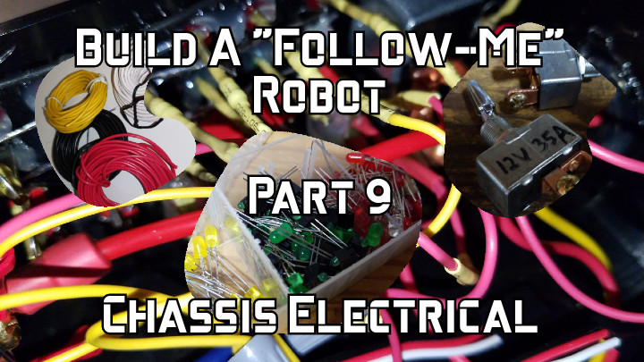](https://www.youtube.com/watch?v=LijISf1I_SE)

Check out the latest on this project and other tutorials at the [Junkbotix Channel](https://www.youtube.com/channel/UCNxQ47xBEYjD-mey_lxj9Aw) on Youtube!

 

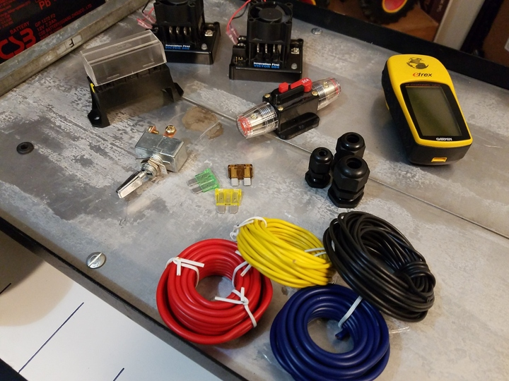&nbsp;&nbsp;&nbsp;&nbsp;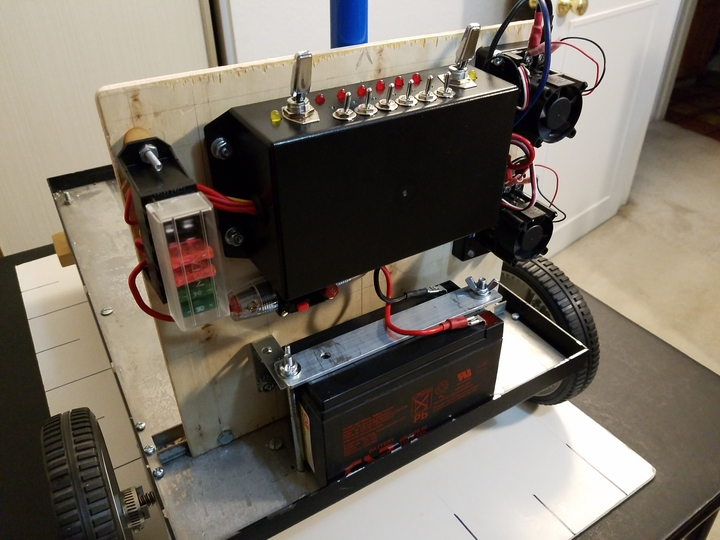

 

Once you have your robot chassis built, you'll need a source of electricity, and ideally a way to control it. Having such a system in place will allow you to more easily develop and maintain the robot's software, while also keeping things neat and tidy, which will help in future maintenance.

But to build such a system, you'll need to plan, design and fabricate it accordingly. How you plan your robot's electrical needs is just as important as its mechanicals, electronics, and code needs. Without a cohesive plan, you might end up with a messy entanglement of wires and tape, making future changes or fixes difficult.

Planning involves coming up with a layout of your electrical system and needs, along with understanding what sub-systems you need to supply power to, and what their voltage and current needs will likely be. How your chassis is built will help determine how you route wiring, and place circuit boards and other parts (indeed, during the design and fabrication of your chassis, you will also need to keep in mind the eventual electrical plan).

This may all sounds like a "chicken-and-egg" problem, but it doesn't have to be. You can design your electrical system first, and then design and fabricate a chassis around that. Or, you can have a rough idea of what you'll later need, and keep it in mind as you build your chassis. You may later need to alter your electrical plans, or even your chassis, but usually, if you have a fairly solid idea in place, any deviations will likely be minor.

## Quicklinks

* [Layout](./layout)
* [Parts](./parts)
  * [Battery](./parts/battery)
  * [Breaker and Fuses](./parts/fuses)
  * [Switches](./parts/switches)
  * [Indicators](./parts/indicators)
  * [Motor Controllers](./parts/motor-controllers)
* [Mechanical](./mechanical)
  * [Panel](./mechanical/panel)
  * [Enclosure](./mechanical/enclosure)
  * [Beacon Support Pole](./mechanical/beacon-pole)
  * [Battery Strap](./mechanical/battery-strap)
* [Wiring](./wiring)

 

## Layout

## Battery (12 VDC, 7Ah)
[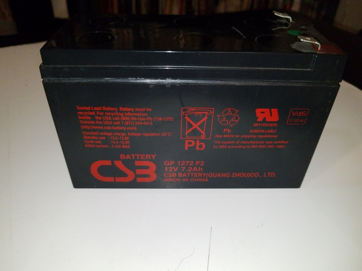](./parts/battery)

## Breaker (30A) and Fuses
[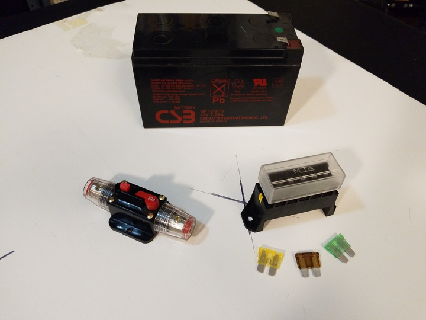](./parts/fuses)

## Switches
[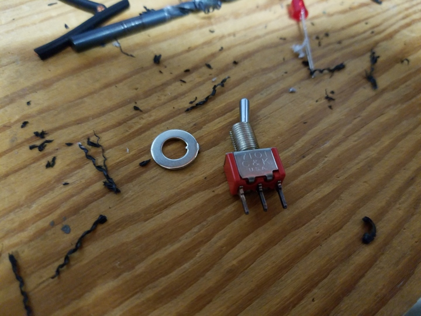](./parts/switches)

## Indicators
[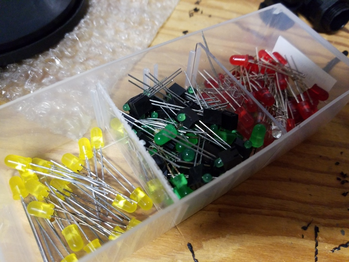](./parts/indicators)

## Motor Controllers
[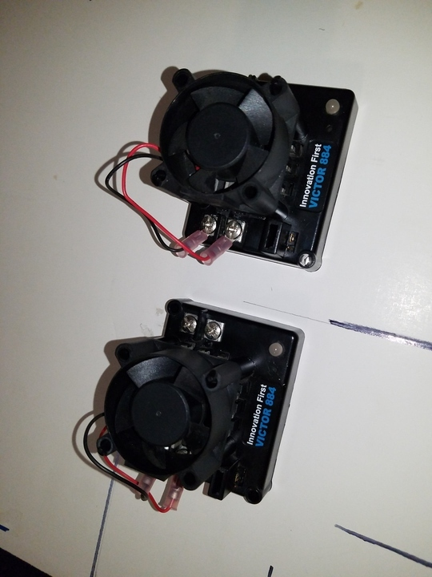](./parts/motor-controllers)

## Panel
[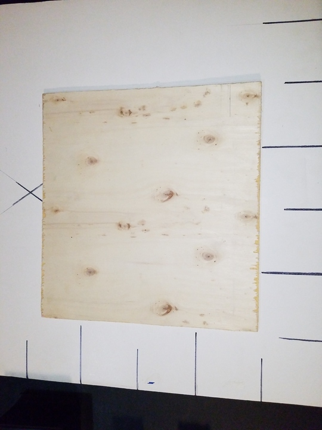](./mechanical/panel)

## Enclosure

## Beacon Support Pole
[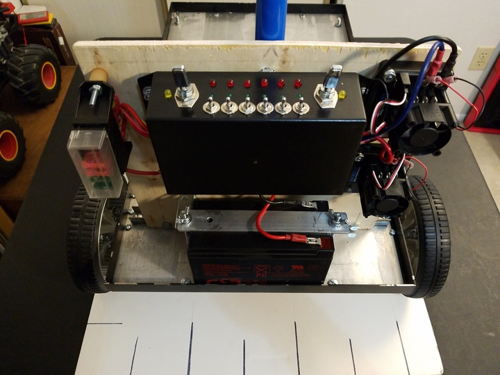](./mechanical/beacon-pole)

## Battery Strap
[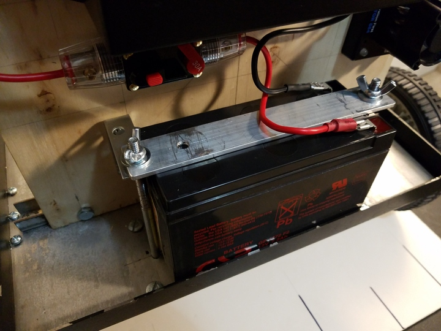](./mechanical/battery-strap)

## Wiring
