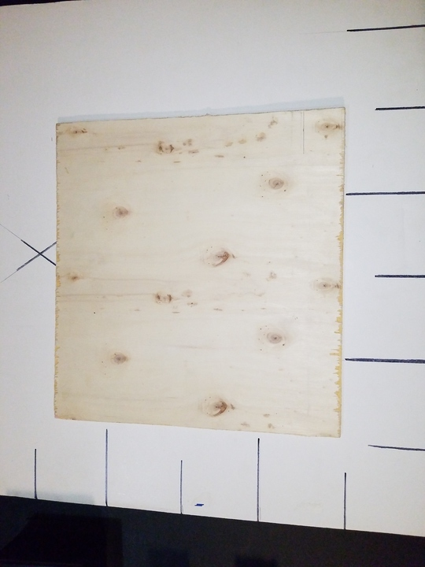
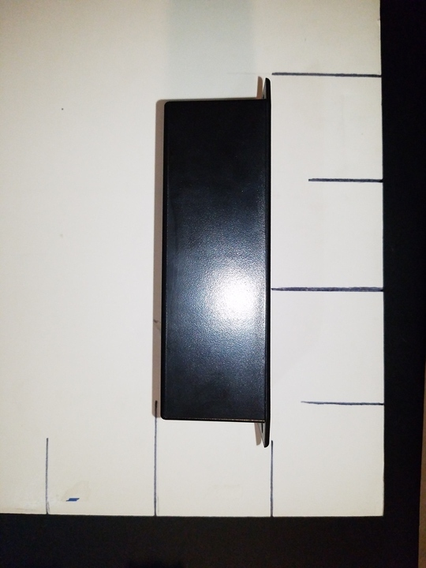
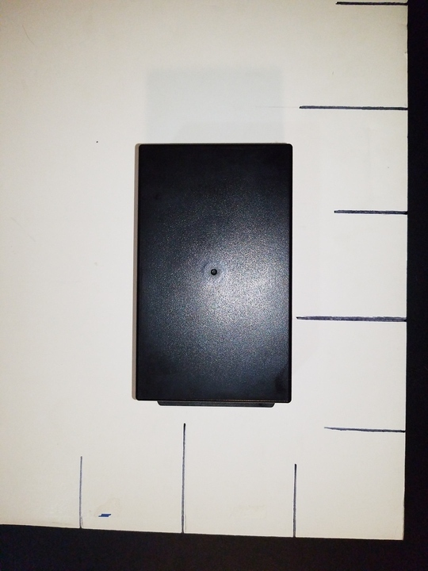

 

Check out the latest on this project and other tutorials at the [Junkbotix Channel](https://www.youtube.com/channel/UCNxQ47xBEYjD-mey_lxj9Aw) on Youtube!

 

## My Initial Layout

The idea for the layout of my electrical system, that I always kept in mind as I built my chassis, can be seen in the above images.

The battery was going to be situated above and behind the rear drive wheels, and everything would be mounted on a vertical panel made from some material, in this case some thin plywood I had laying around. Parts would be mounted on it, with wires neatly organized.

The plywood panel shown above measures about 12 x 12 inches (about 30.5 x 30.5 cm), and if about 3/16" (about 5 mm) in thickness. Above the battery (a 12 volt DC, 7 Ah sealed lead-acid type) are a fuse block and a circuit breaker. 

The breaker would act as both a whole-system overload check, and also as a "main switch" (thanks to the handy reset button and lever). It is located very close to the positive terminal of the battery, and power would be fed from that terminal via heavy wire into its right-hand terminal, exiting the left, which would then feed a "common rail" of the fuses (in the fuse block).

Each fuse would supply power via wires to the interior of the electronics enclosure above the fuse block and breaker, via a hole in the left side of the enclosure.

Power would be controlled by switches mounted on the upper "side" of the enclosure, along with various indicator LEDs to show the status of the fuses, and which switches were "on", giving a handy visual indicator of the system's power distribution and status.

Each switch would control some part of the system: Left-hand drive motor, right-hand drive motor, etc. Power could be selectively enabled or disabled as needed, for development and maintenance purposes.

Wires for power and other systems would exit where needed (mainly from the right-hand side) to deliver that power to the various external systems (in my case, the IFI motor controllers on the right-hand side, as well as a later-planned warning beacon, and the GPS/compass sensor system).

 

## What ended up happening...

Overall, what I ended up building was not that much different than what you see above. The circuit breaker stayed mostly in the same spot, while the fuse block ended up being mounted in a vertical orientation on the left-hand side of the enclosure, which was shifted slightly to the right.

This was done for a couple of reasons:

1. To prevent needing awkward bends on the wires to route them to the fuses (if I had a different kind of fuse block, this might have been avoided)
2. To keep the wires from the fuse block to the enclosure shorter.

Though with these changes, a few other problems cropped up (which will be discussed elsewhere), but they were easily overcome.