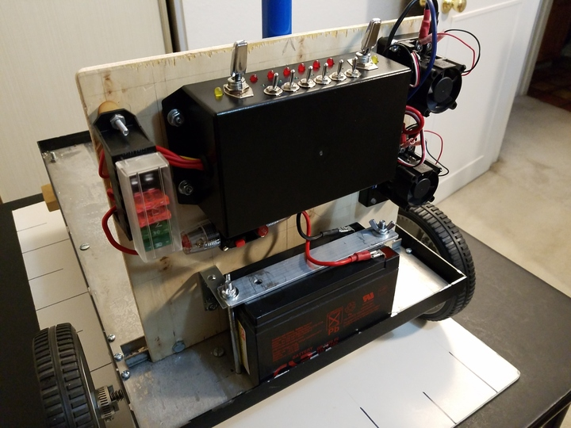
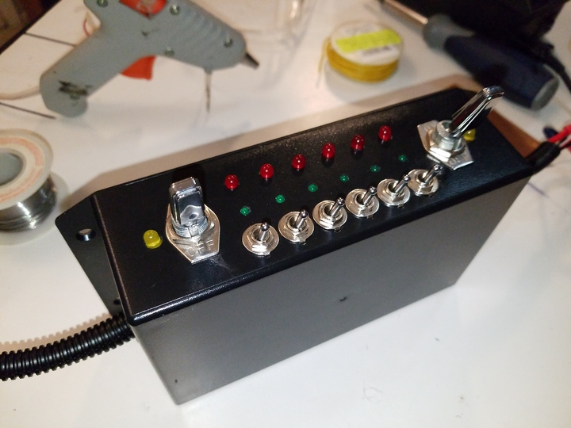

 

Check out the latest on this project and other tutorials at the [Junkbotix Channel](https://www.youtube.com/channel/UCNxQ47xBEYjD-mey_lxj9Aw) on Youtube!

 

## Mechanical

For my robot chassis, I had to fabricate several addition "mechanical" elements in order to complete the implementation of the chassis electrical system. These sections document this effort:

 

## Quicklinks

* [Panel](./panel)
* [Enclosure](./enclosure)
* [Beacon Support Pole](./beacon-pole)
* [Battery Strap](./battery-strap)

 

## Panel

## Enclosure

## Beacon Support Pole

## Battery Strap
