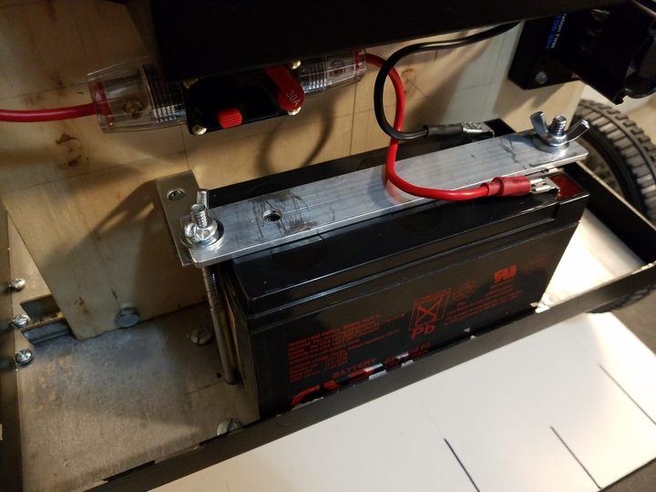

 

Check out the latest on this project and other tutorials at the [Junkbotix Channel](https://www.youtube.com/channel/UCNxQ47xBEYjD-mey_lxj9Aw) on Youtube!

 

## Battery Strap

While you could just set the battery in place, and probably nothing would happen due to it being so heavy, I felt it would be best if I secured it. And the best way is with a metal strap of some kind, bolted down.

As the picture above shows, I used a couple of long bolts, the ones I had originally [made for the casters](../../../chassis-assembly/caster-wheels)! What?!

Yeah! See, I needed some long bolts for this strap, but I didn't have anything that was 1/4-20 and long enough. But in the process of cleaning up and organizing my shop, I did find some longer, fully-threaded 1/4-20 bolts. But they weren't long enough for this use...argh!

But they were long enough for the caster mounting plate! And the custom bolts I had made for that were long enough for the strap! Woohoo! Success!

I then found a piece of aluminium bar stock I had lying around, already with a hole drilled in it (some other project...though I do think I used part of it to make a different hold-down strap for the battery in my Jeep!). A bit of elbow grease and some work with a file, and we had a strap. Add a couple of washers, some wingnuts, and a couple other doodads...and:

 

## A small addition...

Notice on the left side bolt, there's an L-bracket under the strap...what is it for? Well, even with the beacon pole in place, with all the weight on the panel it was still a bit wobbly. Not terribly so, but I felt it could use a bit more re-inforcement. One L-bracket, some quick drilling, and a couple of bolts later...done. No more wobble!