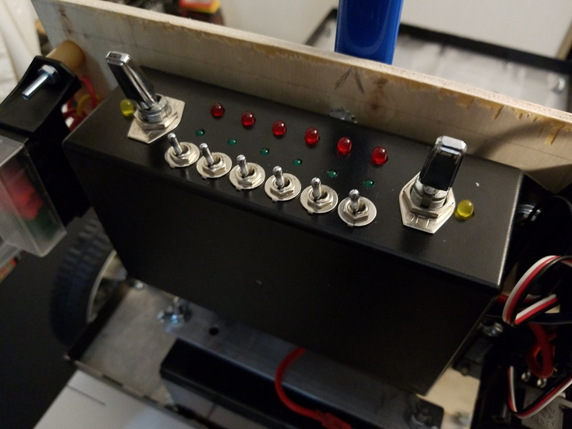

 

Check out the latest on this project and other tutorials at the [Junkbotix Channel](https://www.youtube.com/channel/UCNxQ47xBEYjD-mey_lxj9Aw) on Youtube!

 

## The Beacon Support Pole

So what is the purpose of the beacon support pole? Why have one?

1. It provides a way to stabilize the panel vertically and laterally.
2. It will allow a place to mount the GPS and compass above the chassis and cargo, to allow for a better "clear sky" view for navigation.
3. It will also allow a place to mount a "light beacon", essentially a flashing light, that can be used for robot-to-human communication (primarily as a warning as it is moving around).

Because the panel is only mounted to the robot at the bottom edge (to the motor support bracket), and it will have a lot of weight on it, it needs to be made in some way more "rigid" and secure. Adding the pole does this.

The pole, being mounted to both the motor support bracket and the panel, will also be prevented from tipping fore-aft or side-to-side.

Getting the GPS unit above the ground and cargo will allow it to "see" the sky better, to reduce interference cause by objects blocking (or attenuating) the GPS signals from reaching the receiver.

The flashing beacon light can be used as a warning to others as the robot moves around. It should be high enough to not be blocked visually by most cargo, while remaining visible to both adults and children. It could also potentially be used to communicate error messages or other information to the user.

 

## Mounted

Unfortunately, I didn't take any good pictures of the support pole, as it isn't quite finished, but you can see it here:

 

...and here:

 

It's the blue thing behind the panel, at the top-center-ish of the photos. It originally was a thin-wall metal tube mop handle from my junk pile. 

Note the nut under the enclosure: This is one of the bolts that attaches the pole to the panel. I had to put standoffs under the enclosure to make room for it - a small design change I didn't take into account in the beginning, but not anything that couldn't be easily solved.

 

## What's left to do?

As I noted before, the pole is incomplete. Right now, it mainly serves to keep the panel stable, and nothing more. I need to modify it (drill a hole, add a grommet) to allow wires to be passed up the middle of it for power and data to the GPS unit and beacon. I need to make the mount for the beacon and GPS unit. I need to make the beacon itself...

Whew!