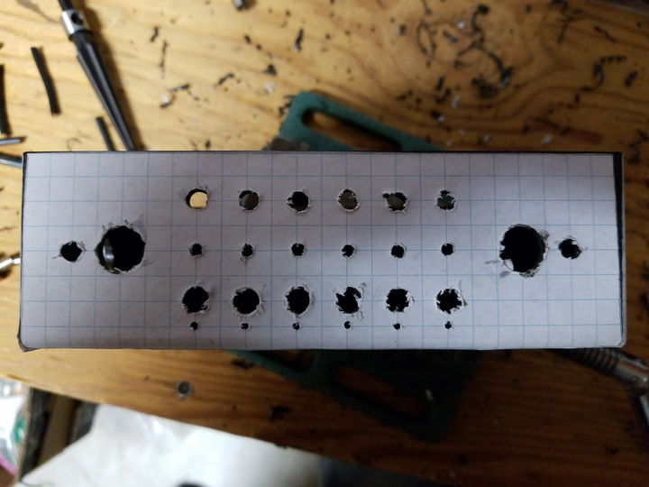

 

Check out the latest on this project and other tutorials at the [Junkbotix Channel](https://www.youtube.com/channel/UCNxQ47xBEYjD-mey_lxj9Aw) on Youtube!

 

## About the Enclosure

The enclosure serves two main purposes:

1. It provides a place to hold the switches and indicators that control the electrical system of the robot.
2. It also safely houses the embedded controller which will control the robot.

In addition to these, it also helps to centralize a bunch of the wiring for the electrical and electronic needs of the robot, to keep them away from the elements, and to present a clean interface to the user and others.

 

## Design and Layout

The enclosure is based around this ABS plastic flanged enclosure, that I believe I picked up surplus at a hamfest years ago:

&nbsp;&nbsp;&nbsp;&nbsp;

 

It measures approximately 6 x 3.5 x 2 inches (not counting the flange).

With this enclosure in mind, I came up with the following rough drawing of how the controls (switches and indicators) should be layed out:

 

From this, I created a set of 1:1 drilling templates using 4-squares-per-inch (1/4") graph paper for the control layout:

&nbsp;&nbsp;&nbsp;&nbsp;

 

...and for the cable holes on the sides:

 

## Mounting the Templates to the Enclosure

Since these were 1:1 drilling templates, they needed to be cut out and mounted to the enclosure. I did this using some Elmers spray glue:

 

## Drilling and Reaming the Holes

All that was left to do was to drill and ream the holes. I first started with the side holes, since if something went wrong, it would have been with one of the basic areas, and not the more complex controls layout. Not ideal for practicing, but I was fairly confident it would all work out.

I used my hand-cranked drill, my small cordless power drill, a step bit and a set of regular bits:

 

...plus this reamer tool:

 

...and gradually drilled and enlarged the hole:

 

...so it could fit one of these cable glands:

 

Then I repeated the process for the other side. Ultimately, I found I couldn't use the cable glands, because they didn't leave enough room for the wires to exit properly to route them to the fusebox and other places. I ended up installing large rubber grommets instead.

I then worked on the control panel area, using the switches:

&nbsp;&nbsp;&nbsp;&nbsp;

 

...and LEDs for reference fit-up as I carefully drilled the holes:

&nbsp;&nbsp;&nbsp;&nbsp;&nbsp;&nbsp;&nbsp;&nbsp;

 

## Removing the Templates

I wasn't exactly sure how I was going to remove the templates after drilling, but I knew I had to do it from a "least-harsh" to "most-harsh" manner. What that means is that I wanted to use techniques that would cause the least harm to the enclosure as possible, in order to remove the template. So I gathered my supplies:

* Paper Towel
* Q-tips
* 91% Rubbing Alcohol
* Goo Gone

 

The least harsh thing to do first, then, was attempt to peel it off by hand. The instructions on the can said this should be possible, but I think I may have applied to thick of a layer of glue:

 

I then tried using the rubbing alcohol to remove the excess bit of stuck-on paper and glue, but it didn't touch it. The glue remained on the surface of the enclosure, and still tacky.

So I tried the Goo Gone fluid (I mention in the video that I thought it was petroleum-based, but it's actually orange oil - still pretty harsh stuff, though) - and it cleaned it up beautifully!

Inspired, I decided to try the other side by wiping it down with the Goo Gone and letting it penetrate. 30 seconds later, and I could just peel the paper off!

 

I repeated the process with the front template, and removed it, then cleaned up the oily residue of the Goo Gone using the rubbing alcohol...a total success!

 

## Completing the Enclosure

After that, it was just a matter of installing the switches and indicator LEDs:

&nbsp;&nbsp;&nbsp;&nbsp;

 

...and the enclosure was ready to be mounted:

 

## Postmortem

What would I do differently next time?

1. Use a larger enclosure.
2. Use an enclosure where the "top" was a panel, instead of being the body.
3. Use some other kind of glue? Less sticky?
4. Drill more side hole (two per side would have been better).
5. Flipped the layout of the indicators and switches, to move the switches closer to the edge for easier access.

Even so, I consider this to be a successful enclosure fabrication. Maybe not as accurate as I would have liked, but really not too bad for all the "free-form" of the design and such...