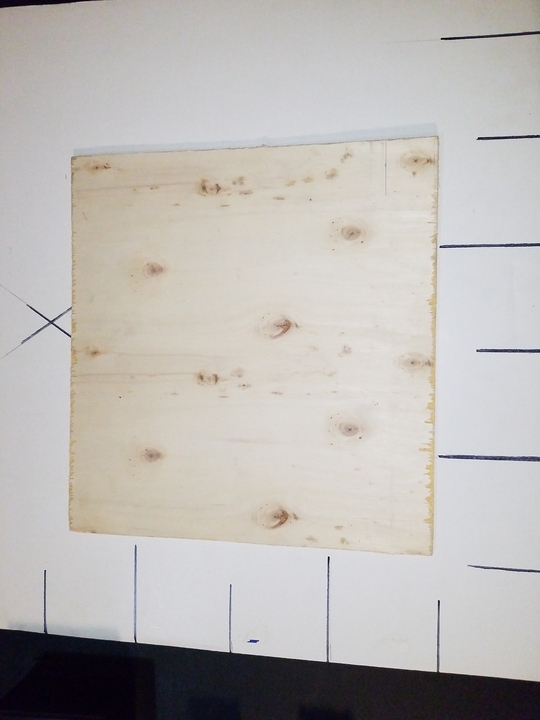

 

&nbsp;&nbsp;&nbsp;&nbsp;&nbsp;&nbsp;&nbsp;&nbsp;

Check out the latest on this project and other tutorials at the [Junkbotix Channel](https://www.youtube.com/channel/UCNxQ47xBEYjD-mey_lxj9Aw) on Youtube!

 

## The Panel

The purpose of the panel is to ultimately hold all of these parts:

...and others, vertically and out of the way of the cargo area of the chassis. The panel is mounted vertically, between the steel motor bracket bar at the rear of the chassis, and the battery. The beacon support pole, standing vertically from the center of the motor bracket bar, helps to stabilize the panel (while keeping the pole from tipping to the side).

 

## The Electrical Bits

The battery is connected to a 30 amp breaker, which is then connected to a fuse block:

Please see the section on [wiring](../../wiring) for more details...

 

## Final Results

&nbsp;&nbsp;&nbsp;&nbsp;