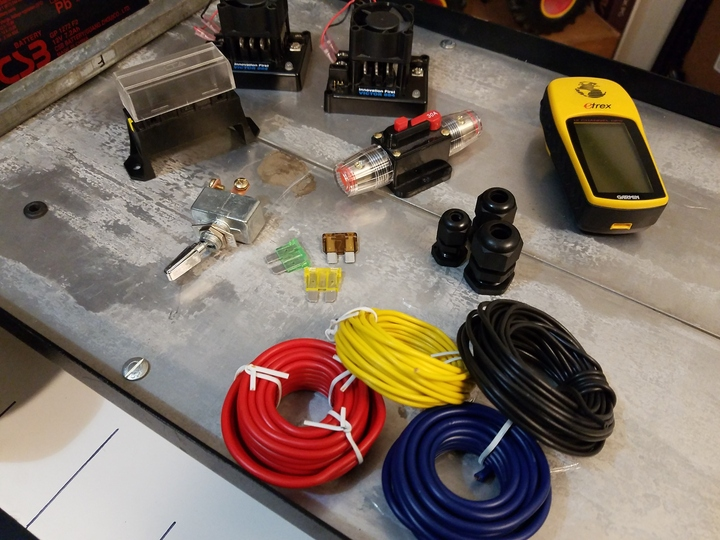

 

Check out the latest on this project and other tutorials at the [Junkbotix Channel](https://www.youtube.com/channel/UCNxQ47xBEYjD-mey_lxj9Aw) on Youtube!

 

## Parts

There are many different parts that can make up a robot's chassis electrical system, but the most important ones are the battery(s) and fuses (and/or breakers). The others aren't strictly needed, but you may want to give them consideration.

While they can make the design more complicated, they also introduce useful features which can help in future development and maintenance of your robot. Each of these parts will be detailed in its own separate section:

 

## Quicklinks

* [Battery](./battery)
* [Breaker and Fuses](./fuses)
* [Switches](./switches)
* [Indicators](./indicators)
* [Motor Controllers](./motor-controllers)

 

## Battery (12 VDC, 7Ah)

## Breaker (30A) and Fuses

## Switches

## Indicators

## Motor Controllers
