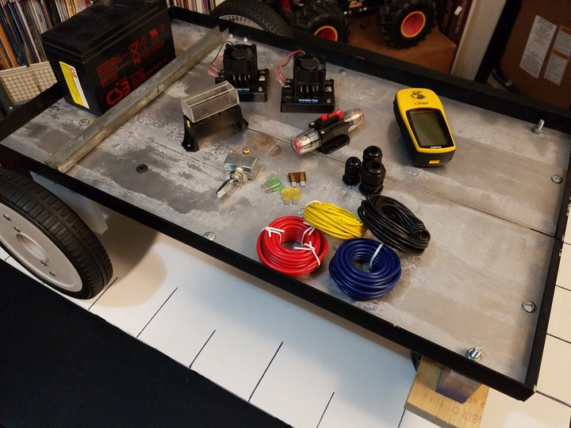

 

Check out the latest on this project and other tutorials at the [Junkbotix Channel](https://www.youtube.com/channel/UCNxQ47xBEYjD-mey_lxj9Aw) on Youtube!

 

## The Battery

For my robot, I'll be using a standard 12 volt, 7 Amp-Hour "sealed lead-acid" (SLA) battery. Such batteries, while not lightweight, are robust and inexpensive. For this robot chassis, the weight will not be an issue, as it can easily handle it.

 

## Placement

I'm placing the battery behind and above the motors, like this:

 

## LiFePo Batteries?

If you wanted to use something of a lighter weight, though, LiFePo batteries of the same size can be found easily. While they are more expensive than regular SLA-type batteries, they more than make up for it in weight savings. However, they require a specific kind of charger that can deliver the right voltage, so the monetrary combination of the charger and the battery can be a daunting hurdle to overcome.

 

## Other Batteries?

Using other batteries is all dependent on your robot's needs in voltage and current, along with its size. Feel free to try other battery types in your design!