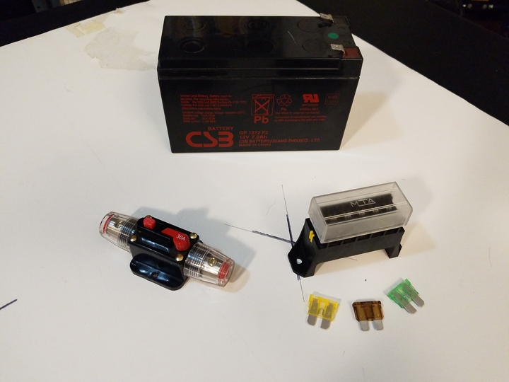

 

Check out the latest on this project and other tutorials at the [Junkbotix Channel](https://www.youtube.com/channel/UCNxQ47xBEYjD-mey_lxj9Aw) on Youtube!

 

## The Breaker

For controlling the current going to my robot's various systems, I'm using a combination of a single large 30A circuit breaker and fuses:

The circuit breaker will limit the total current draw of the system to a maximum of 30 amps. While both of my motors together will draw much more than that (regardless of the rest of the system), such a draw won't likely happen because I'll code things to ramp the voltage (and speed of the motors) up and down in the code. 

This should limit the peak current, but if for some reason both motors get locked up, or something equally strange and catastropic occurs, this breaker should help prevent any conflagaration from developing.

These breakers come in a variety of sizes and shapes - I had this one on-hand from another project that was never finished (hopefully I can return to it at some point!).

Note: I'm also using the breaker's "reset functionality" (lever and button) as a handy "whole system switch", which was easier to do than using another switch or method. While not designed for this purpose, I believe it will be robust enough for the purpose, so long as I don't attempt to switch it on or off when the system is under a full load (which isn't a likely scenario).

 

## Fuses

Following the breaker, a fuse block and fuses will be used to protect against over-current draws from invididual sub-systems:

While I only show three fuses here, they are for illustration purposes only. In my actual robot, I'll have four circuits protected by fuses:

1. Left Motor and Controller (25A)
2. Right Motor and Controller (25A)
3. Enclosure Electronics (embedded system - 5A)
4. External Electronics (beacon light, future GPS power, etc - 5A)

 

You can see in the image below how I feed the fuse block from the breaker, and then have configured the branch circuits as follows:

* Fuses 1 and 2 are for the motors (note heavy gauge wire)
* Fuses 3 and 4 are for the smaller loads (note smaller gauge wire)
* Fuse slots 5 and 6 are empty (future use?)

This is done just using simple crimped 1/4" connectors, which slip (very tightly) over the terminals of the fuse block (underneath):

&nbsp;&nbsp;&nbsp;&nbsp;

 

## Do you have to use fuses and breakers?

No...but if you don't, and something goes wrong, some part of your robot's electrical or electronic system will act as the fuse for you! This could easily lead to a great deal of smoke and fire!

You may find, in your testing and development, that you are constantly replacing blown fuses for one reason or another. If this is the case, consider installing small in-line circuit breakers, if you have the room and the money to do so. They can be found in a variety of sizes, and come in either auto-reset or manually resettable types.

But whatever you do, don't just go and "increase the size of the fuse or breaker" when it is constantly tripping. If that is happening, stop and re-assess what is going on, and double check that you don't have some intermittent short, or some other reason that is causing the system to constantly trip the protection on the circuit.

 

## Where to find fuses and breakers?

Of course, you can purchase these things brand new: My 30 amp breaker was that way, but for an ealier (and unfinished) project. But my fuse block and fuses were all found via surplus electronic vendors. You can also find fuses and possibly useful fuse blocks from old vehicles (at a salvage yard, for instance). Or, in a pinch, you can fashion something on your own using wood or plastic, or some other non-conductive material, and 1/4" crimp connectors (which will slip over the blades of the small fuses like I am using).

 

## Other possibilities?

Ok - I haven't tried this - but I know its been used in the past for certain kinds of electronic projects: Light bulbs! Specifically, incandescent bulbs. A "cold" unlit bulb looks like a zero-ohm (~) current path to a circuit, but when a certain level of current is drawn (say when a short develops), the excess current causes the bulb to glow, which raises its resistance (to a limit - after which the bulb will fail - like a fuse). In effect, you can "see" the amount of current being drawn - the brighter the bulb is, the more current is being drawn.

I won't go into any more details on this, but just google "light bulb current limiter" to learn more...