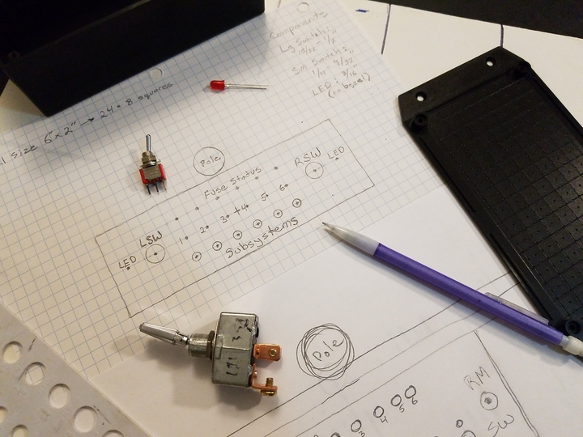
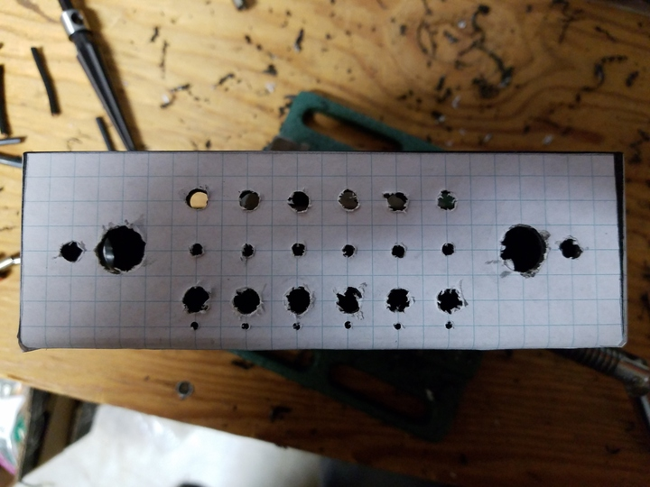
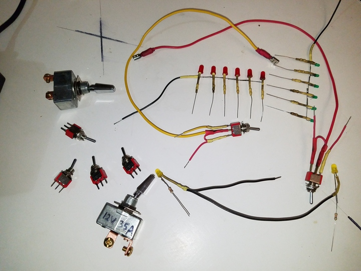
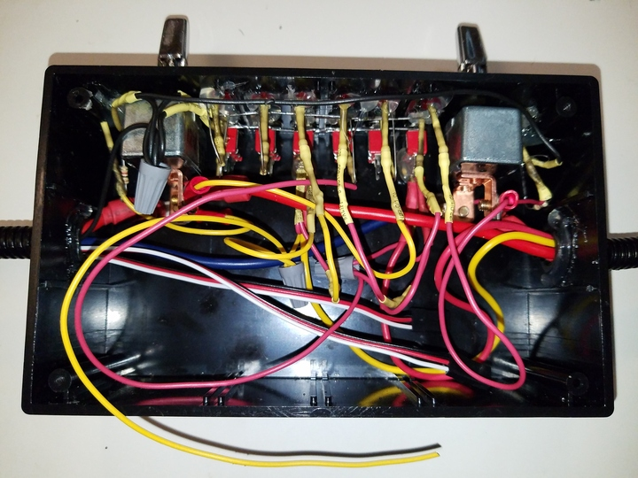
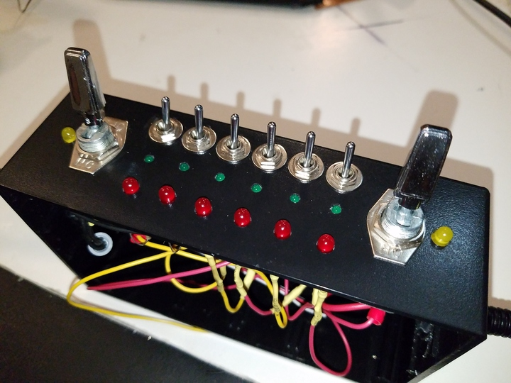

 

Check out the latest on this project and other tutorials at the [Junkbotix Channel](https://www.youtube.com/channel/UCNxQ47xBEYjD-mey_lxj9Aw) on Youtube!

 

## Indicators

As mentioned in the section about the [switches](../switches), for each switch there is an indicator LED associated with it. For the large switches, they are located to the side of each switch (yellow LEDs). For the smaller switches, they are located above the switches (green LEDs):

Finally, there are six red LEDs along the top edge to indicate the status of each circuit after its fuse.

 

## Wiring

Each set of indicator LEDs are wired with their cathodes (-) common to ground, while the anodes (+) are connected to inline current limiting resistors of 1K ohms for 12 volts (voltage drop calc'd as 2 volts for all LEDs):

Using [this calculator](https://ohmslawcalculator.com/led-resistor-calculator) and plugging the numbers in, you get 10 mA of current through the LEDs, which worked well in my case.

 

The other leg of the resistor was connected to the appropriate voltage, after the switch or after the fuses, depending on the indicator type:

 

## Postmortem

If I had to do this over again (and who really knows, maybe I will have to someday!), I wouldn't do the "common rail" thing again. I would instead come up with a different wiring solution, and probably mounting solution...or something. The main issue is the fact that there is so little room to work in, in order to hook up wires to the other "dummy" switches, given where they are located and such. As you can see from the above photos, it ain't a pretty thing...