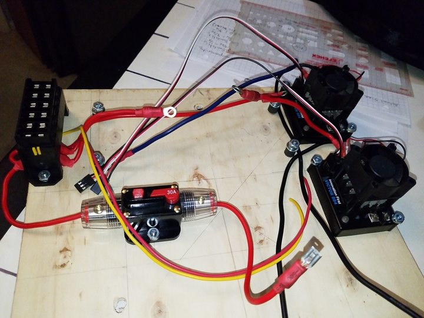

 

Check out the latest on this project and other tutorials at the [Junkbotix Channel](https://www.youtube.com/channel/UCNxQ47xBEYjD-mey_lxj9Aw) on Youtube!

 

## Motor Controllers

For control of the motors, I am using a set of IFI Victor 884 controllers. To give you an idea of what the wiring looks like (without the enclosure):

It's not easy to see, but there are two thick red wires coming from the fuse block, one much shorter than the other, and both are terminated in crimped ring terminals. These are the fused 12 volt positive rails that go to each motor switch inside the enclosure. 

You'll also notice two other wires, coming from the motor controllers: A thick, but short, red wire, and from the other a longer blue wire. Both again terminate in ring connectors. These come from the positive terminals of the controllers, and go to the other terminals on each motor switch.

Finally, there are two thick black wires coming from the negative terminals of the motor controllers, to be hooked up to the negative terminal of the battery.

 

## More Information

More information about these controllers can be [found here](../../../motor-control/victor-884-888).