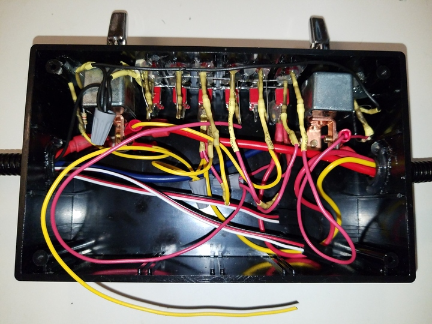

 

&nbsp;&nbsp;&nbsp;&nbsp;

Check out the latest on this project and other tutorials at the [Junkbotix Channel](https://www.youtube.com/channel/UCNxQ47xBEYjD-mey_lxj9Aw) on Youtube!

 

## Switches

As I noted in the section about [fuses](../fuses), I'm using the 30 amp breaker's reset lever and switch as a simple "whole system switch":

 

After that breaker and the fuses, though, I wanted a way to control the current going to each of my subsystems (motors, embedded controller, etc). To do this, I'm going to be using a couple of different sized switches, mounted on the enclosure:

 

The large switches are for controlling the current going to the motors. They were rated on the packaging they came in as 12 volt, 35 amp switches, but on the bottom of the switch they are marked as 50 amps. I figure that the lower amperage is more likely correct, and it is still far higher than what the switch should encounter:

 

The smaller switches will be used for various lower-current (5 amps or less) sub-circuits:

These switches were found as surplus, and are C&K 7101 switches, rated to 5 amps at 28 volts DC ([datasheet](./files/ck-7000-toggle.pdf))

 

## Mounting the Switches

The fuses will be mounted to the enclosure by first drilling it using a template:

 

The large holes on the right and left are for the large switches (the smaller holes to the left and right of the larger holes are for the indicator LEDs), while the six 1/4" sized holes along the bottom are for the smaller switches (the remaining holes are for other indicator LEDs).

After mounting and a bit of wiring, they look like this:

&nbsp;&nbsp;&nbsp;&nbsp;

 

...and here is how they will look from the standpoint of the robot's user:

## A Few Other Notes

When mounting switches to a panel or enclosure, for best appearances you want all of the levers to be positioned at the same height, and within the designed layout. In this case, all of my switches fall along common lines on the 1/4" graph paper I am using for the drilling template.

I don't have any pictures, but on the inside of the enclosure were some ridges that would prevent the smaller switches from sitting properly flush (the larger switches didn't have this problem). So the ends of the toggles weren't lining up properly.

What I did to solve this was to back off the backside nut on the "higher" switches to "lower" them (this is one of the purposes of the screw threads on the switch body).

Also - note the tiny "holes" (they aren't holes, actually - they are only divots partially drilled into the surface of the enclosure) along the bottom of the holes for the small switches...

If you take a look at the picture of the small switch, you'll notice a small washer-like item next to the switch. Note how it has a "tab" on the inner side of the ring, and a small hook-like tab opposite. The inner tab slides into a groove on the screwthread area of the switch (you can almost see this in the photo), and the outer hook is meant to go into - tada! - the divot (or a small hole). The purpose of this is to "lock" the switch from rotating during use, in case the hex nuts holding the switch to the panel loosen up.

Use them if your switch has 'em!

The larger switches didn't have anything like this, unfortunately - so I just had to align things and tighten them down...