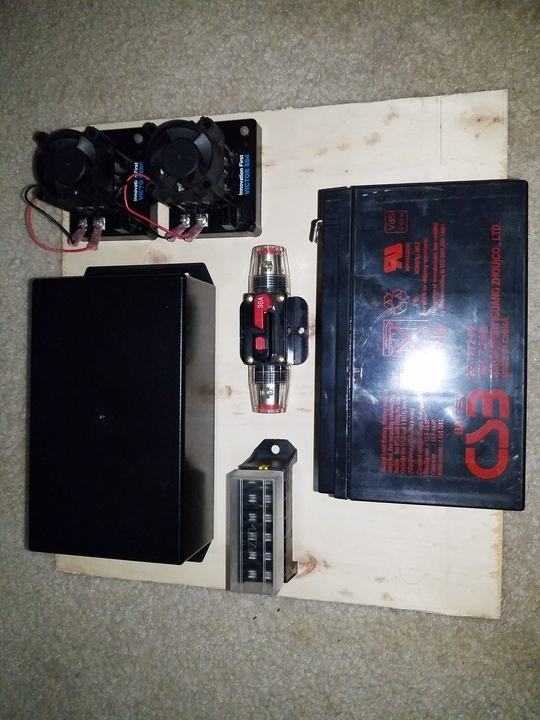
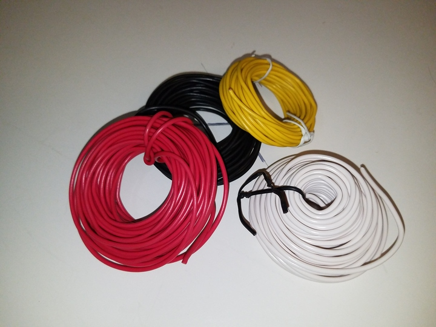
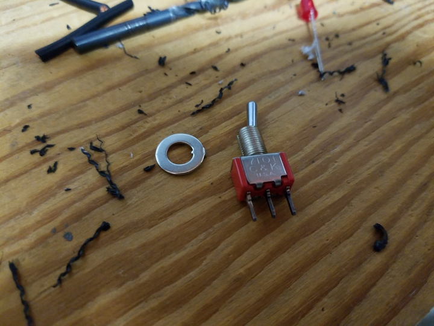
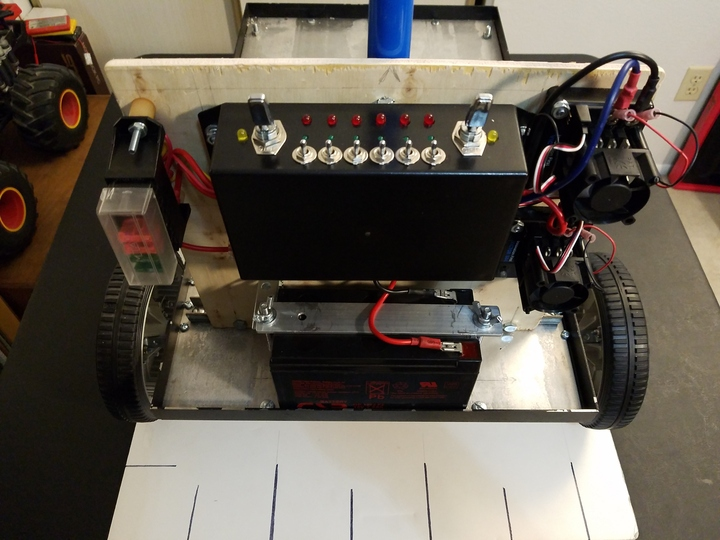

 

&nbsp;&nbsp;&nbsp;&nbsp;

Check out the latest on this project and other tutorials at the [Junkbotix Channel](https://www.youtube.com/channel/UCNxQ47xBEYjD-mey_lxj9Aw) on Youtube!

 

## Wiring All The Things

Once I had the panel layout ready, and the parts mounted, and the enclosure fabricated, it was time to wire everything up.

It was probably one of the most challenging portions of this robot so far...which was somewhat unexpected. How could stripping some wires, crimping this or that, soldering a bit, etc...how could any of that be difficult?

Well, it wasn't that any of it was difficult, it was more the orchestration of doing things in the right order at the right time, while taking care not to paint myself into a corner, and keeping all of that straight, while not having any formal plans on how to do it all...it was an exercise in patience and frustration.

Could it have been planned out first? Maybe. But I honestly think if I had tried that, I would have missed a step or something along the way anyhow...

 

## The Raw Materials

Wires, switches, parts, tools, and more...ohhh, my!

&nbsp;&nbsp;&nbsp;&nbsp;

&nbsp;&nbsp;&nbsp;&nbsp;

&nbsp;&nbsp;&nbsp;&nbsp;

 

All this and more was needed to wire this thing up (well, except for the cable glands). Where to start?

 

## The Design and Layout

I had the design and layout ready...it was going to look something like this:

 

Before I get into that, let's look at the wire that will be used:

&nbsp;&nbsp;&nbsp;&nbsp;

At the small end of the scale, I'll be using both 22 gauge (AWG) wire (left), and 16 gauge wire (right). This wire will mainly be used for the lower current hookups.

 

For main power needs, and for the motors, I'm going to use 12 gauge wire:

 

10 gauge probably would've been a better choice, but because the circuit lengths are not very long, it should be able to handle the current being drawn. It might get a little warm, but nothing outside its temperature specs. Fingers crossed, anyhow!

 

So, the first thing to do was to wire the battery to the breaker, and the breaker to the fuses. So, some wires were cut and crimped, most from the 12 gauge wire:

 

Then the wires were hooked up to the appropriate parts:

&nbsp;&nbsp;&nbsp;&nbsp;

 

Note also the inclusion of the servo cables for the motor controllers:

 

These were originally extension cables, but I removed the sheath off the male end so it could be plugged into the control port on the Victor-884. The other end will be plugged into a header supplying power and PWM signals from the embedded controller.

 

## Wiring the Enclosure

Next was to wire up the enclosure, and then add it to the panel. First I had to wire up the indicators, made from various LEDs:

&nbsp;&nbsp;&nbsp;&nbsp;

 

Once those were done, the large switch indicators were mounted into the drilled enclosure, and the small switches were then wired up:

&nbsp;&nbsp;&nbsp;&nbsp;

 

Then the large switches and the remaining indicators could be put into place:

&nbsp;&nbsp;&nbsp;&nbsp;

 

...and OMG:

&nbsp;&nbsp;&nbsp;&nbsp;

&nbsp;&nbsp;&nbsp;&nbsp;

&nbsp;&nbsp;&nbsp;&nbsp;

 

But we end up with something beautiful, as long as we don't look at that other side - lol!

&nbsp;&nbsp;&nbsp;&nbsp;&nbsp;&nbsp;&nbsp;&nbsp;

 

And the connection to the battery, of course!

