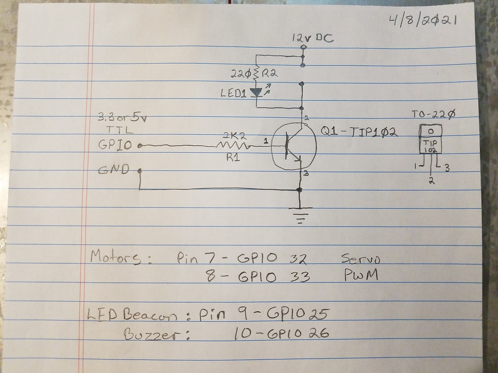

 

Check out the latest on this project and other tutorials at the [Junkbotix Channel](https://www.youtube.com/channel/UCNxQ47xBEYjD-mey_lxj9Aw) on Youtube!

 

## The Controller Prototype and Schematics

I started designing this controller mainly using a couple prototypes (note the reset circuit on the second one):

&nbsp;&nbsp;&nbsp;&nbsp;

 

...and these hand-drawn schematics I created based on the prototypes:

&nbsp;&nbsp;&nbsp;&nbsp;

 

## Robot Functions and Notes

* WiFi - ADC2 pins are used for WiFi - avoid pins 9-13, 15, 23-26
* GPS
  * Use pin 1 for 3.3v power to MAX232 adapter (do not use to power eTrex!)
  * Use pins 27 and 28 for comms
  * Pin 28 = GPIO17 = TX2: Connect to RX from MAX232 converter
  * Pin 27 = GPIO16 = RX2: Connect to TX from MAX232 converter  
* MotorA - Servo PWM - Use pin 7 (GPIO32)
* MotorB - Servo PWM - Use pin 8 (GPIO33)
* Beacon - LED flasher beacon - Use pin 9 (GPIO25)
* Buzzer - Audible beacon - Use pin 10 (GPIO26)

 

## Garmin eTrex - RS-232 (MAX232)

1. Supply MAX232 adapter from Pin 1 (3.3v).
2. Set I/O to NMEA OUT or TEXT OUT?
3. NMEA OUT => NMEA 0183 v3.0 (data output format)
4. TEXT OUT => simple ASCII of location and velocity info?
5. Settings: 4800 baud, 8 bits, no parity, no flow-control

 

For the MAX232 mini-PCB I used the pinout on the board:

&nbsp;&nbsp;&nbsp;&nbsp;

## Calculations

These calculations were done to determine a suitable base resistor for the TIP-102; They didn't quite turn out right, but they got me in the ballpark, at least.

 

## PCB Layout Photos and Sketches

You can possibly use these images of the front and back of the PCB, along with the above schematic diagrams, to reproduce the controller board in some fashion:

&nbsp;&nbsp;&nbsp;&nbsp;

 

Finally, these extremely rough sketches, which I made mainly as a reference to keep things straight in my head as I was soldering the PCB together, show how the parts on the board are arranged:

&nbsp;&nbsp;&nbsp;&nbsp;

The first depicts how and where I was going to place the PCB inside the original enclosure. Instead, I had to [fabricate a piggy-back enclosure](./enclosure) for it...

 

## Additional Files

* [ESP32 Pinout](./files/esp32-pinout.jpg)
* [ESP32 Pins and Functions](./files/pins-and-functions.txt)
* [General Auto-Reset Circuit](./files/general-auto-reset.jpg)
* [TIP102 datasheet](./files/TIP102.pdf)
* [MAX232 datasheet](./files/MAX3232.pdf)
* [AD84064 datasheet (chinese) - 12 to 5 volt voltage regulator (in USB automotive charger)](./files/AD84064.pdf)

## Notes

1. ESP32 board pinouts vary (yours may not match mine!)...
2. Note that the auto-reset circuit specifies a 10K resistor and a 0.1uF (electrolytic) capacitor; these values may need to be altered on a board-by-board basis...
3. The AD84064 datasheet only seems to be available in the Chinese language, but it does include enough information in English to get an idea how it works. The example circuit shown was virtually identical to the one in the USB charger I used...
4. The ESP32 uses an AMS117 LDO regulator, to convert 5V to 3.3V. Schematic seems to indicate that input voltage could be higher (up to 12 volts). Output should be stable as long as supply voltage and current can be met. So the 12V to 5V adapter should be ok. And using the MAX232 adapter on 3.3 volts shouldn't be a problem, either.