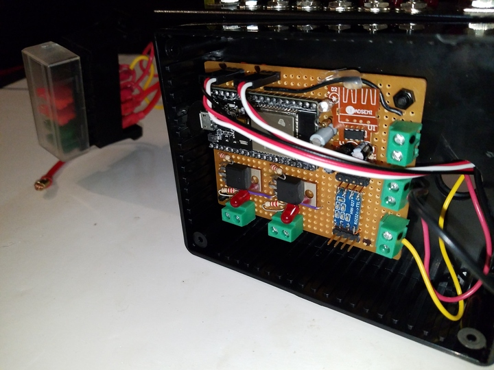

 

Check out the latest on this project and other tutorials at the [Junkbotix Channel](https://www.youtube.com/channel/UCNxQ47xBEYjD-mey_lxj9Aw) on Youtube!

 

## A Piggy-back Enclosure

I had intended on mounting the controller inside the original enclosure. However, when I was verifying where and how I wanted to mount it, I ran into a problem:

It wouldn't fit!

Due to the size of the controller PCB (printed circuit board) and where various switches and LEDs were located inside the enclosure, coupled with the height of the components both above the PCB and the leads under it, there wasn't any way to squeeze it into the space remaining as I had originally planned.

So I quickly fabricated a "piggy-back" enclosure just for the controller:

&nbsp;&nbsp;&nbsp;&nbsp;

&nbsp;&nbsp;&nbsp;&nbsp;

I mounted the PCB on the left side of this new enclosure, to allow access to the ESP32's USB port for making programming easier (there's a hole drilled on the side of the piggy-back enclosure, centered on the port). 

I mounted the piggy-back enclosure on the right side of the main enclosure, to allow for a shorter run for the servo cables to the motor controllers. A hole between the enclosures allow the cables to pass safely through.

Cables for the beacons and GPS unit are routed into the bottom of the main enclosure and through the hole into the piggy-back enclosure to attach to the PCB.