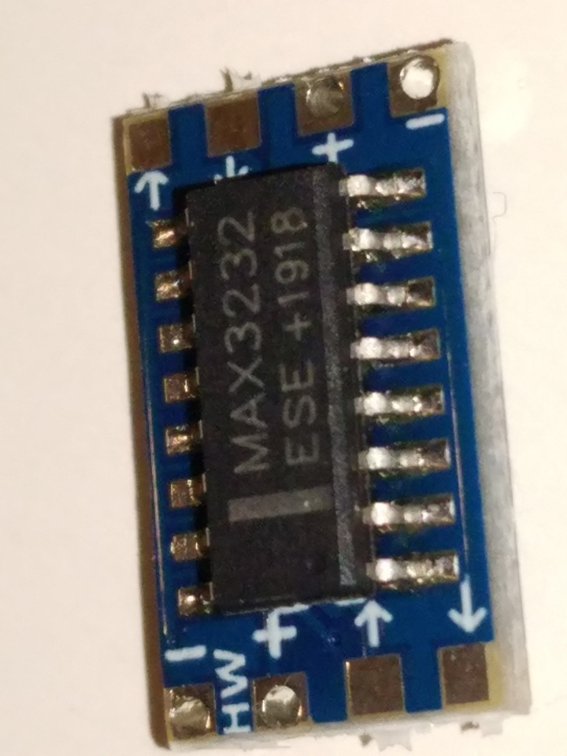
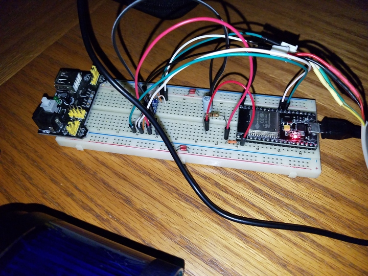

 

Check out the latest on this project and other tutorials at the [Junkbotix Channel](https://www.youtube.com/channel/UCNxQ47xBEYjD-mey_lxj9Aw) on Youtube!

 

## GPS Sensor - Garmin Etrex

The GPS sensor I am using is an old Garmin Etrex handheld GPS unit, meant for outdoor activities like hiking and bicycling. It's not the fastest, nor can it pick up as many satellites as newer sensor modules can, but it's what I had on hand in my junk pile.

 

 

The Etrex includes a handy data port - but unfortunately, it's standard RS-232 only (told ya it was old!)...

 

 

While the ESP32 is expecting 3.3v TTL for its serial port. The solution is to use some form of level conversion - I chose to use a [MAX232 chip](./max232) variant:

&nbsp;&nbsp;&nbsp;&nbsp;

 

Connection to the ESP32 is fairly easy - the hardest part is the tediuous connecting of small wires to the MAX232 carrier board. Also the process of [building a custom interface cable](./interface-cable). But in the end, it all worked out fine...

&nbsp;&nbsp;&nbsp;&nbsp;

&nbsp;&nbsp;&nbsp;&nbsp;

 

## Quicklinks

* [MAX232 Details](./max232)
* [Custom Interface Cable](./interface-cable)

## Additional Files

* [ESP32 Pinout](./files/esp32-pinout.jpg)
* [ESP32 Pins and Functions](./files/pins-and-functions.txt)
* [MAX232 datasheet](./max232/files/MAX3232.pdf)
* [Garmin Etrex Manual](./files/etrex-manual.pdf)
* [Etrex RMC NMEA Sample](./files/etrex-rmc-nmea-output.txt)
* [Parsing RMC NMEA Sentences](./files/NMEA-parsing.txt)

 

## Notes

1. The Garmin Etrex doesn't include a magnetic compass: The sensor has to be moving in order for the unit to know it's heading. This may or may not prove problematic for the software I'll implement to control the robot...
2. The GPS data sample was gathered from the "demo mode" of the unit.
3. On the Etrex, set I/O to NMEA OUT or TEXT OUT
   * NMEA OUT => NMEA 0183 v3.0 (data output format)
   * TEXT OUT => simple ASCII of location and velocity info?
4. The RS-232 settings are 4800 bps, 8 bits, no parity, 1 stop bit (4800 8N1).