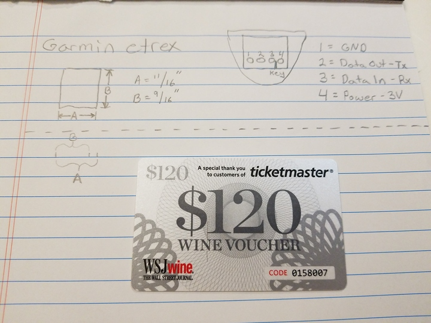
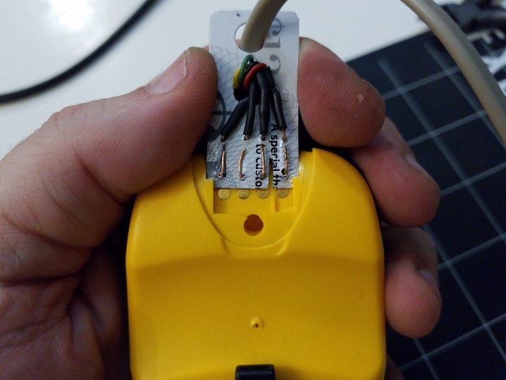

 

Check out the latest on this project and other tutorials at the [Junkbotix Channel](https://www.youtube.com/channel/UCNxQ47xBEYjD-mey_lxj9Aw) on Youtube!

 

## Garmin Etrex Custom Interface Cable

Whether you're interfacing the Garmin Etrex to your computer, or to a microcontroller, you need a cable to connect to it. While it is still possible to buy such a cable for this unit (usually pre-owned), that isn't really in the spirit of Junkbotix.

I recalled that back when I bought my Etrex (from someone on Craigslist), there was a web page that described how to build your own cable using a small piece of plastic cut "just right" and such.

Unfortunately, I couldn't locate that page again, but I did find [this web page](https://www.weethet.nl/english/gps_garmin_etrex_to_rs232.php), which gave me a starting point.

 

## How to build your own Garmin Etrex cable

### Materials and Tools Needed:

* Garmin Etrex
* Old credit card or similar plastic
* 4-conductor wire
* Thin solid-core wire (for contacts)
* Implement to poke small holes (a pin, needle, thumbtack, etc can be used)
* Soldering kit
* Pliers
* Lighter (optional)

 
1. Get a piece of plastic, about the thickness of a credit card. An old credit card is perfect, but in a pinch, cheap gift cards and similar plastic cards can be used as well. Using the measurements below, measure and cut out a piece of the material.
   
&nbsp;&nbsp;&nbsp;&nbsp; 

 
2. Test fit the card in the Etrex to verify its fit, and to note where the "key" is, as well as how the contacts line up. Cut a slot for the key, and use a small implement to poke some small holes in the card. The holes should be the same size as the diameter of the wire you intend to use for the contacts.

&nbsp;&nbsp;&nbsp;&nbsp; 

 
3. Use a hole punch to punch a couple of holes to act as a "strain relief" for the cable, which I'm making from some old 4-conductor (stranded) telephone cable.
   
&nbsp;&nbsp;&nbsp;&nbsp; 

 
4. Strip and tin one end of the bare thin gauge solid core wire; also strip and tin the ends of the four conductors in your cable.

&nbsp;&nbsp;&nbsp;&nbsp; 

&nbsp;&nbsp;&nbsp;&nbsp; 

 
5. Once the ends are tinned, insert them thru the holes and bend them over to make the contacts. Note the thin profile of the contacts - when I made mine, just after I bent the ends, but before I put them through the holes, I heated them up with a lighter, then "squeezed" (embedded) them into the plastic with a pair of pliers, to make the raised profile smaller.

&nbsp;&nbsp;&nbsp;&nbsp; 
&nbsp;&nbsp;&nbsp;&nbsp;&nbsp;&nbsp;&nbsp;&nbsp; 

 
6. Verify the position of the contacts, then slot it into place on the Etrex.

&nbsp;&nbsp;&nbsp;&nbsp; 

 

## Notes

1. Try to be as accurate as possible when poking the holes for the contact wires.
2. Just aboue any wire can be used for the 4-conductor cable, but thinner stranded wire is best.
3. This is another one of those areas where a 3D printer would have been helpful...