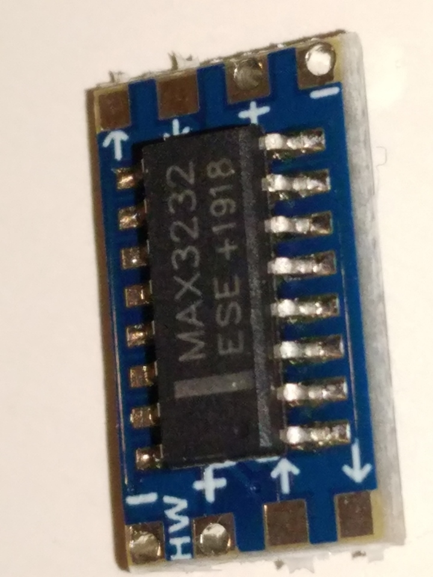
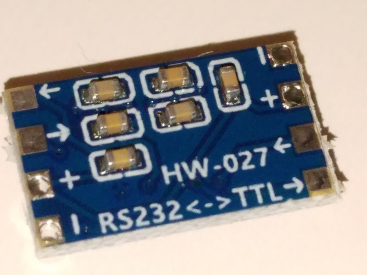
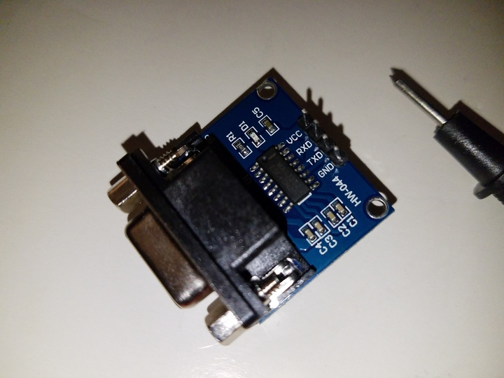
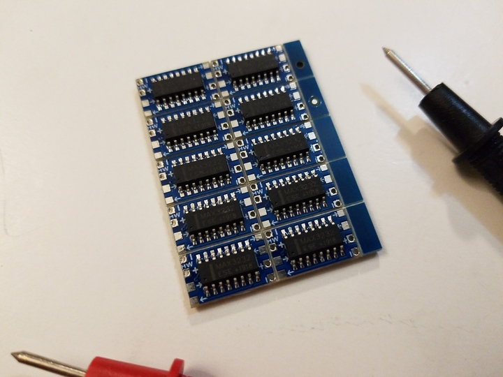
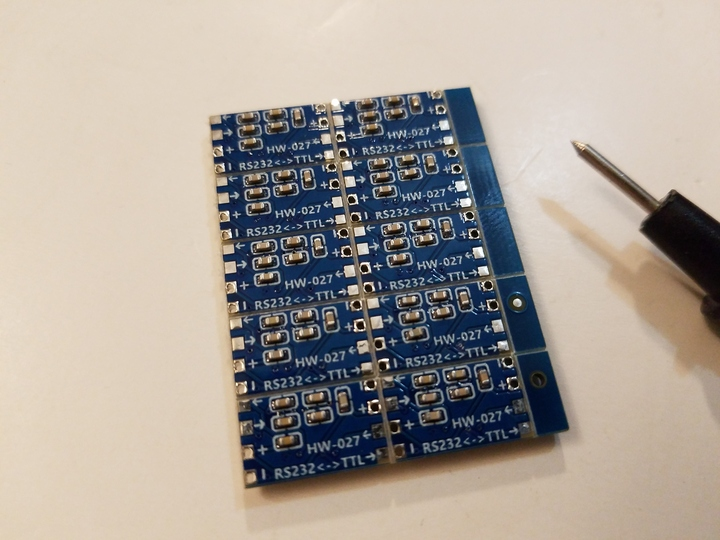

 

Check out the latest on this project and other tutorials at the [Junkbotix Channel](https://www.youtube.com/channel/UCNxQ47xBEYjD-mey_lxj9Aw) on Youtube!

 

## MAX232 (MAX3232) Level Converter

The MAX232 level converter can be found in a variety of formats, including thru-hole DIP (to which you need to add some simple passive components). But the form most common today for hobbyists is either the basic carrier board module, or the 9-pin D-SUB carrier board module.

&nbsp;&nbsp;&nbsp;&nbsp;

 

Both utilise the surface mount MAX3232 chip for the level conversion.

## Of particular note...

I found several comments on the internet that the chip used on these may be 3.3v only. Reports indicated that if higher voltages were used, the chip would become very hot and not function (eventually becoming inoperable). I did not attempt to verify this, and used a 3.3v source (from the ESP32 - the regulator supplies enough current to allow for this) to power the module instead.

## Where to buy

The 9-pin D-SUB module is sold just as you see above. A four pin header acts as the interface to the TTL level circuitry, with the 9-pin D-SUB interfacing to standard RS-232 signal levels.

The bare module itself is usually sold in multiples as a "break-apart" panel:

&nbsp;&nbsp;&nbsp;&nbsp;

I purchased mine a while back from Amazon. You can find similar modules on Ebay, AliExpress, and many other places.

## Other Options for Level Conversion

If you don't have access to these particular chips or something similar, you can also do level conversion using a simple transistor-based circuit. Just google "RS232 to TTL Converter Schematic" - numerous examples can be found.

 

## Additional Files

* [MAX232 datasheet](./files/MAX3232.pdf)