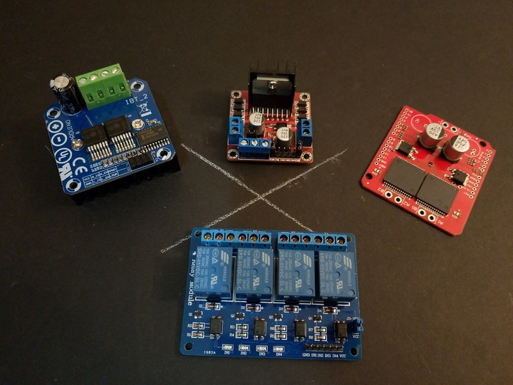
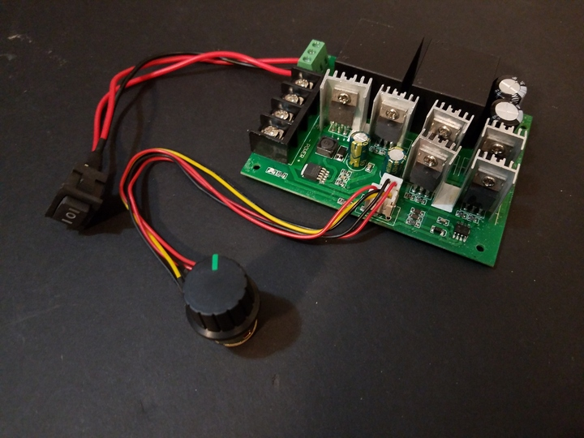

 

Check out the latest on this project and other tutorials at the [Junkbotix Channel](https://www.youtube.com/channel/UCNxQ47xBEYjD-mey_lxj9Aw) on Youtube!

 

## H-Bridges

Useful when direct control of speed and direction of your motor is needed.
 

 [Various H-Bridge Modules](./h-bridges)

 

## RC Electronic Speed Controllers (ESC)

Used when you need or want to use RC (radio control) signals to control your motors, and add a degree of "intelligence", depending on the ESC used.
 

 [RC Electronic Speed Controllers (ESC)](./esc)

 

## Generic DC Motor Reversible Speed Controller

This kind of controller needs hacking to be useful, but it is inexpensive and powerful.
 

 [Generic DC Motor Controller](./generic-controller)

 

## Motor Controllers

If more intelligence is needed, these FRC (FIRST Robotics) controllers can fit the bill; in addition RC PPM/PWM for control, the Jaguar controller can be interfaced using RS-232 and/or CAN over a serial bus, which can be daisy-chained, reducing the number of wires and pins needed for control.
 

 [MDL-BDC(24) Jaguar (FRC)](./jaguar)

 

The Victor-884 and 888 controllers are closer to ruggedized RC ESC controllers, and can't be daisy-chained. Less intelligence, but easier to configure.
 

 [Victor-884 and 888 (FRC)](./victor-884-888)