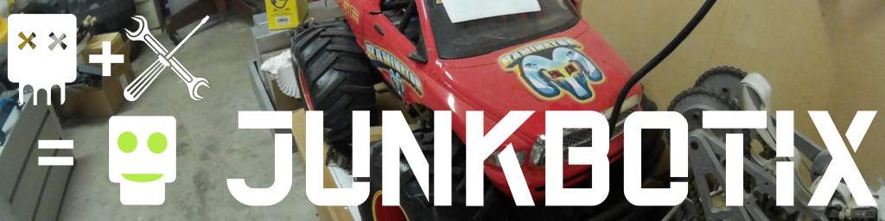

 

## RC Electronic Speed Controllers (ESC)

 

Used when you need or want to use RC (radio control) signals to control your motors, and add a degree of "intelligence", depending on the ESC used.

The particular ESC shown above is fairly generic, and can usually be found by searching for "320A High Voltage ESC Brushed Controller", or similar terms.

The following information comes from various vendor product descriptions, some specs (particularly the current rating) should be met with some healthy skepticism.

### Features

* Power range: 7.2V-16V
* Input voltage: 6-12 cells NiMH/NiCd or 2-4 cells LiPo
* BEC: 5.6V 2A
* Output current: 320A (forward)
* Out of control for protection (?)
* Low voltage protection
* Over-voltage protection
* With heat sink
* For 540 dual motor or single motor
* Operating modes: forward, reverse, and brake
* Size: 42x34x47mm
* Weight: 60g (including connectors and switches)

### Operational Guidelines

1. The right and a power supply battery connection on both ends of the wiring board the red line for positive, black, compared with negative. (Or standard DC battery connection plug Tamiya male plug / T-plug / banana plug)

2. ESC output red and black wire are connected to the red and black lines of the car 540 motor.

3. Turn on the ESC power switch. If no signal input, ESC will send a beep ~ beep ~ beep "alarm sound". Turn on the transmitter power. Signal from the receiver will activate the ESC with another tone of mi ~~ mi, has been connected to prove the transmitted signal and receiving the electrical and mechanical tone.

## Notes

1. Current rating is suspect, or only for fairly brief periods (instantaneous or limited seconds).
2. BEC (battery elimination circuit) is used to provide power to servos, figure 1 amp per servo.
3. I've tried to clarify some of the "operational guidelines", but further research is needed.