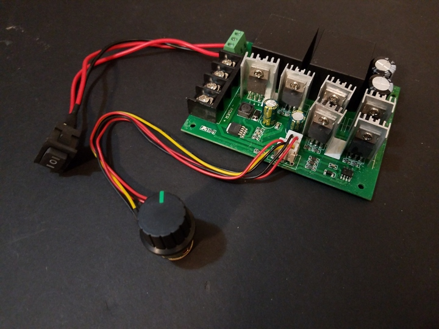
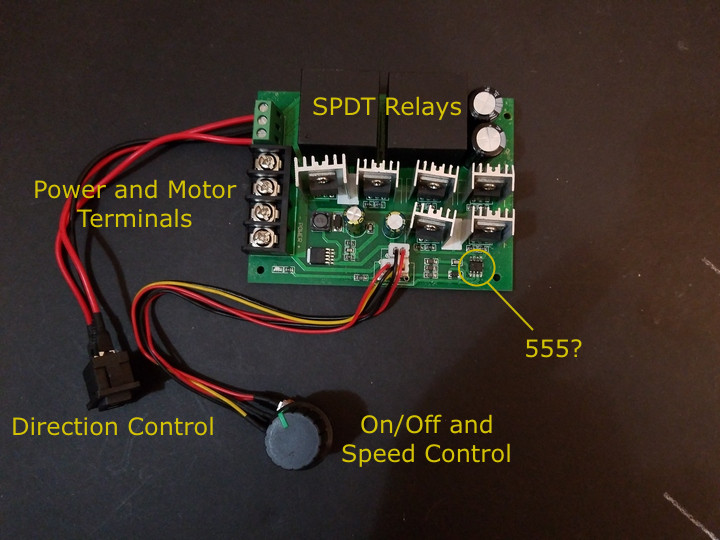

 

## Generic DC Motor Reversible Speed Controller

 

This kind of controller needs hacking to be useful, but it is inexpensive and powerful. It is fairly generic:

* "DC 12/24/36/48V 60A PWM Motor Speed Controller with CW CCW Reversible Switch"

The following specifications are from the vendor's description, and should not be considered 100% accurate.

 

### Specifications ([User Manual](./manual/40A-reversing-motor-controller.pdf))

* Supports: Brushed DC motor
* Working voltage: DC 10V - 50V
* Output voltage: Linearity Under Load
* Maximum current: 60A
* Constant current: 40A
* Standby current: 0.01A
* Speed regulation method: Potentiometer (switched)
* Speed control type: PWM
* PWM Frequency: 15KHz
* Speed control range: 0% - 100%
* Direction control: Rocker Switch, Forward-Stop-Backward.
* Board size: 100mm * 75mm * 28mm
* Net weight: 180g

 

## Notes

1. Control of direction and on/off could be done using a pair of relays.
2. Control of speed via servo (connected to potentiometer) or digital pot.
3. Or maybe some kind of set of switched resistors?
4. There also appears to be something that might be a 555 timer for PWM?
5. MOSFETs on-board might be for relay control, or all in parallel for PWM speed control.
6. Other multi-pin heatsinked IC might be a voltage regulator.
7. More research is needed...