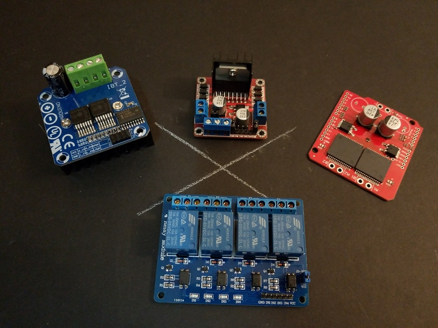

 

 

## H-Bridges

Useful when direct control of speed and direction of your motor is needed.
 

* [BTS-7960 - Generic 43A H-Bridge Controller Module](./bts-7960-ibt-2-module)
* [L298 - Generic Low-Amperage Module](./l298-module)
* [Monster Moto Shield - Generic High-Amperage Module](./monster-moto-shield)
* [Relay Bridges](./relay-bridge)