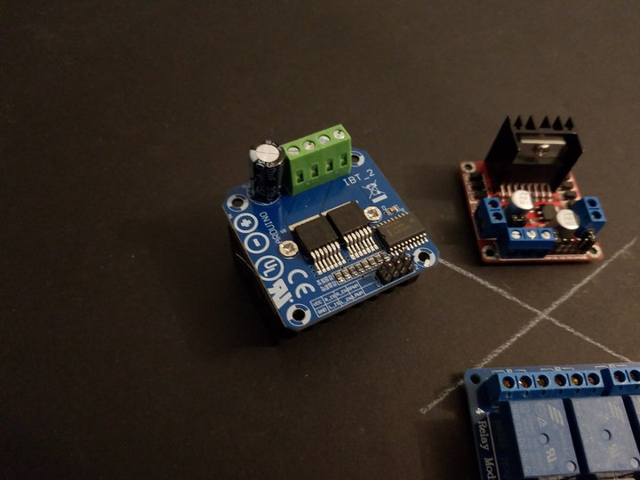

 

## Generic BTS-7960 43A H-Bridge Controller Module

 

This particular h-bridge module is fairly generic, and is offered by a variety of vendors online. As such, it tends to be relatively inexpensive, and is usually called something like:

* "BTS7960 43A High Power Motor Driver Module / Smart Car Driver Module"

The following description and specifications are from the vendor, and should not be considered 100% accurate.

 

### Description

This driver uses Infineon chips BTS7960 composed of high-power drive full H-bridge driver module with thermal over-current protection. Double BTS7960 H-bridge driver circuit, with a strong drive and braking, effectively isolating the microcontroller and motor driver! High-current 43A.

 

### Specifications

* Model: IBT-2
* Supports: Brushed DC motor
* Input voltage: 6V - 27V
* Maximum current: 43A
* Input level: 3.3 - 5V
* Control method: PWM
* Duty cycle: 0-100%

 

### Input port

1. RPWM - Forward level or PWM signal input, active high
2. LPWM - Reverse level or PWM signal input, active high
3. R_EN - Forward drive enable input, high-level enable, low level off
4. L_EN - Reverse drive enable input, high-level enable, low level off
5. R_IS - Forward drive current alarm output
6. L_IS - Reverse drive current alarm output
7. VCC - +5 V power output, 5V power supply connection with the microcontroller
8. GND - signal common low end

 

## Notes

1. [BTS7960_H-Bridge_Module_Notes.zip](./files/BTS7960_H-Bridge_Module_Notes.zip) - Contains a lot of useful information on various bits of this module - a must read!
2. Be sure to check and double-check the heat sink, paste, etc - according to the information I found and is in the above file, this is a source of many issues - thermal overload, not enough paste, shorting of pads, and other not-so-fun-stuff. Check out the notes file above for more!

## Datasheets

* [BTS7960 Datasheet](./files/Infineon-BTS7960_v1.1_2004-12-07.pdf)
* [BTN7960 Datasheet](./files/Infineon-BTN7960-DS-v01_01-en-785559.pdf)

These datasheets are for the h-bridge ICs used on the module. Most modules have and use the BTS7960, but there are some out there that use the BTN7960 variant. I believe they are both the same - that is, a drop-in replacement. But there might be some differences that a thorough reading and comparison of the datasheets might reveal, which I have not done. If anyone knows, shoot me an email or something!

