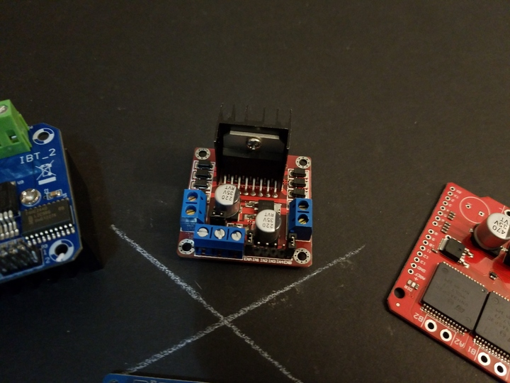

 

## Generic L298 Low-Amperage H-Bridge Module

 

This particular h-bridge module is very generic, and is offered by a variety of vendors online, in a variety of forms. As such, it tends to be very inexpensive. Just search for "L298 module" and you'll find something!

Since it is so common and well known, I'm only going to link a few useful documents, but there is a ton of information about these modules online.

 

### Datasheet, Schematic, and Guide

* [L298 Datasheet (ST)](./files/ST-L298.pdf) - Datasheet for the on-board h-bridge IC
* [L298 Reference Schematic](./files/reference-schematic.pdf) - This is -not- the schematic for the module, but is probably fairly representative
* [L298 Module Quick Start Guide](./files/L298N_H-Bridge_DC_Motor_Driver_Module_Quick_Start_Guide.zip) - I found this online several years ago, maybe it's still around, but this is my offline copy