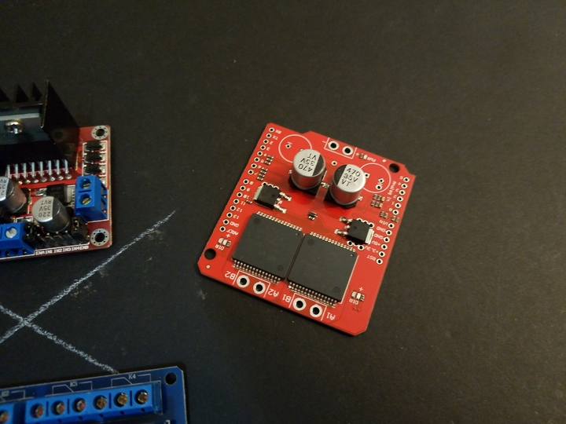

 

## Monster Moto Shield - Generic High-Amperage Module

 

Yet another fairly generic h-bridge built around a pair of common driver ICs. Unlike the BTS-7960, these modules can control two motors (there does exist a single-motor module, too). These are offered and sold by a variety of vendors online and is relatively inexpensive, and is usually called something like:

* "Dual VNH2SP30 Stepper Motor Driver Module"

The following specifications are from the vendor, and should not be considered 100% accurate.

 

### Description

This is essentially a ramped up version of our Ardumoto motor driver shield. For this monster shield we've replaced the L298 H-bridge with a pair of VNH2SP30 full-bridge motor drivers. We've also beefed up the support circuitry so this board is capable of driving a pair of high-current motors! The VIN and motor out are pitched for our 5mm screw terminals (not included), making it easy to connect larger gauge wires.

 

### Features

* Voltage max: 16V
* Maximum current rating: 30 A
* Practical Continuous Current: 14 A
* MOSFET on-resistance: 19 mΩ (per leg)
* Maximum PWM frequency: 20 kHz
* Current sensing available to Arduino analog pin
* Thermal Protection (shutdown)
* Undervoltage and Overvoltage Protection (shutdown)

 

### Vendor Note

When using this board in extreme high-demand applications it may be necessary to improve thermal performance with a heat-sink or fan and to solder the wires directly to the board instead of using a screw terminal (in addition to the myriad other complications present in a high-current system). However, when using the board at currents up to 6A the chips will barely become noticeably warm.

 

## Notes

1. This is an actual shield, that can be plugged into a standard Arduino Uno and similar (I am not sure if it is compatible with the Mega).
2. It comes with header pins that need to be soldered before using it as a shield.
3. With such a combination, the possibility of implementing a custom controller is acheivable.
4. As noted above, this module will need aggressive heatsinking and cooling to reach its full potential.

 

## Datasheet and Schematics

* [VNH2SP30 Datasheet](./files/VNH2SP30_Datasheet.pdf)
* [Schematic](./files/MonsterMoto-Shield-v12.pdf)
* [Alternative Schematic](./files/schematic.png)

## Connection Setups for Arduino

* [Single Board, Single Motor](./setup/single-board-one-motor-connections.jpg)
* [Single Board, Dual Motors](./setup/single-board-dual-motor-connections.jpg)
* [Dual Board, Dual Motors](./setup/dual-board-dual-motor-connections.jpg)

## Software

* [Sparkfun's Archive - Code, Design Files, etc](./files/Monster_Moto_Shield.zip)
* [Older Sparkfun Code Example](./files/MonsterMoto_Shield_Example.pde)