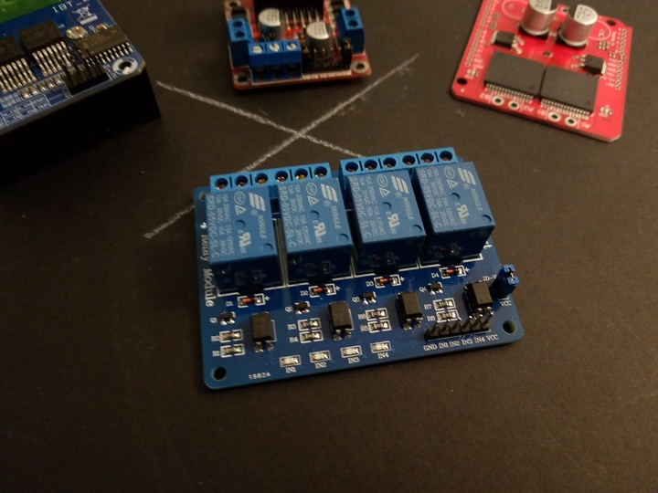
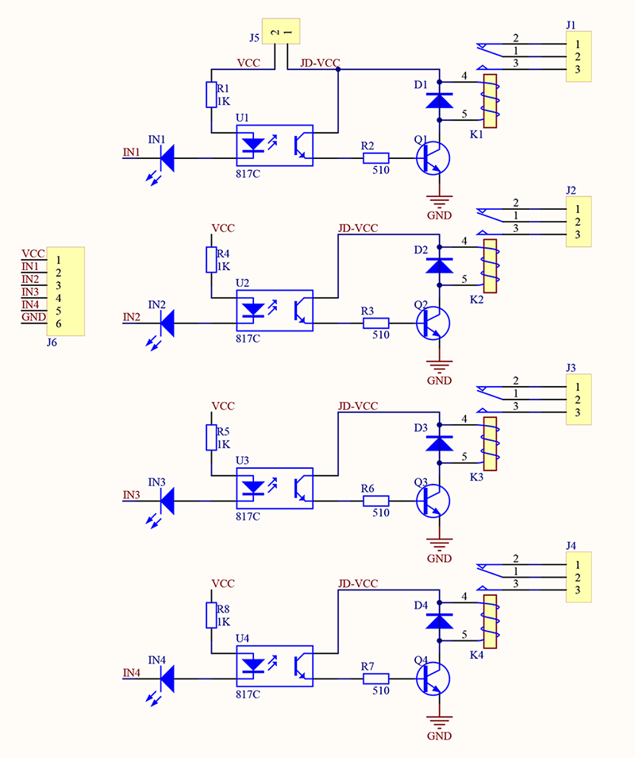
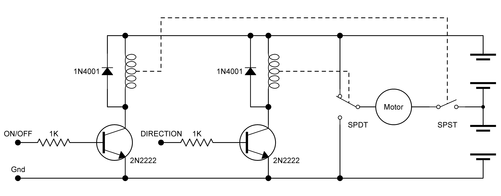
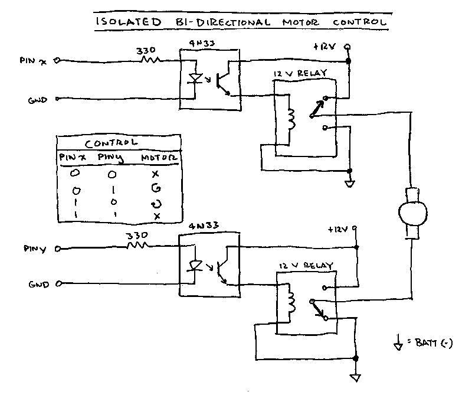
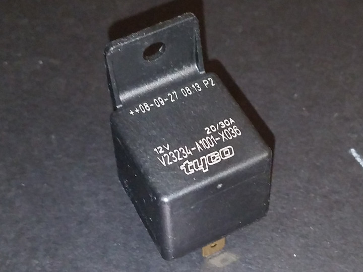
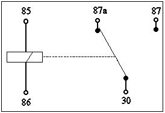
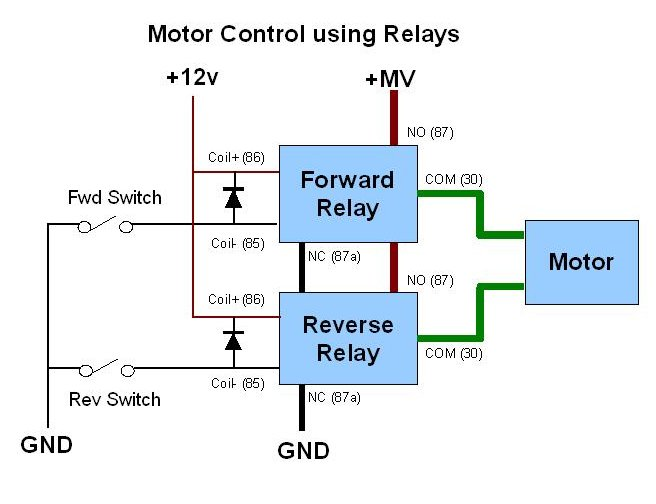
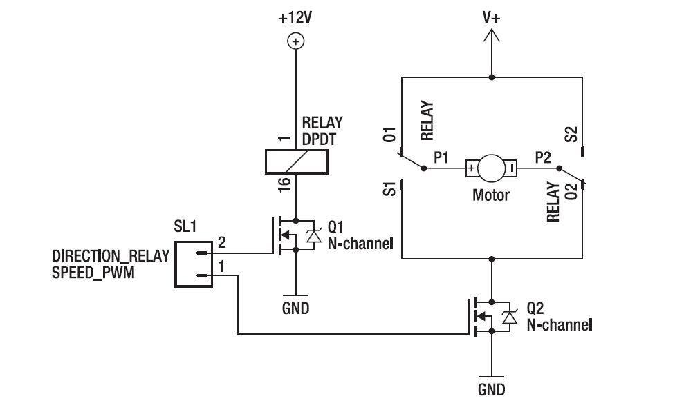

 

## Relay Bridges

 

These relay modules are also widely available and inexpensive. They come in a variety of configurations, having 1, 2, 4, or 8 relays. Each relay is usually a 10A SPDT. Some boards, like this one, are opto-isolated (and as such, usually can be used with 3.3v TTL outputs, too). But not all are.

 

## Schematic

 

## Relay H-Bridge

A pair of the relays can be used to build a simple and controllable h-bridge:

 
Note the dual-ended motor power supply in the above schematic; compare it with the following (which is also opto-isolated):

 

## Using Bosch Relays

It might also be possible to desolder the relays from such a relay module, and replace them with pairs of Bosch automotive relays, for greater current handling:

Bosch SPDT Relay 

Bosch SPDT Relay Pinout 

Motor Control 

Alternatively, you can just replace the switches with transistors, as before, to control the relays.

 

## MOSFET Speed Control (hybrid bridge)

A mosfet can also be used on the low-side of the bridge to control the speed of the motor:

Note that this schematic shows a DPDT relay being used, but it isn't common to find such relays with high-current carrying contacts, which is why pairs of SPDT relays are usually used.