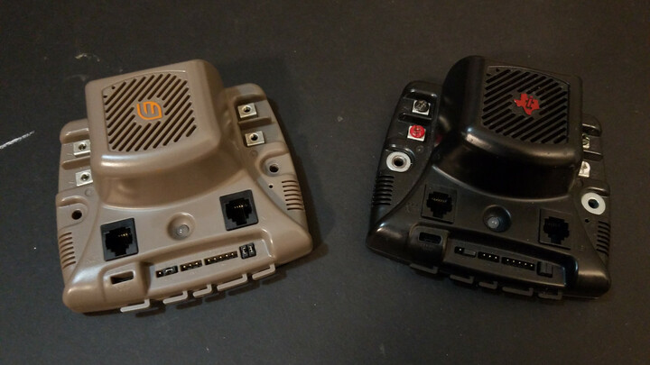

 

## MDL-BDC(24) Jaguar (FRC)

 

If more intelligence is needed, these FRC (FIRST Robotics) controllers can fit the bill; in addition RC PPM/PWM for control, the Jaguar controller can be interfaced using RS-232 and/or CAN over a serial bus, which can be daisy-chained, reducing the number of wires and pins needed for control.

* [Luminary Micro MDL-BDC Gray Jaguar](./lm-mdl-bdc)
* [Texas Instruments MDL-BDC24 Black Jaguar](./ti-mdl-bdc24)

Both of these are now discontinued, but you can find them being sold on the secondary market.

 

## Additional Documentation

* [2012 FRC Jaguar FAQ](./frc-2012/Jaguar_FRC_2012_FAQ.pdf)
