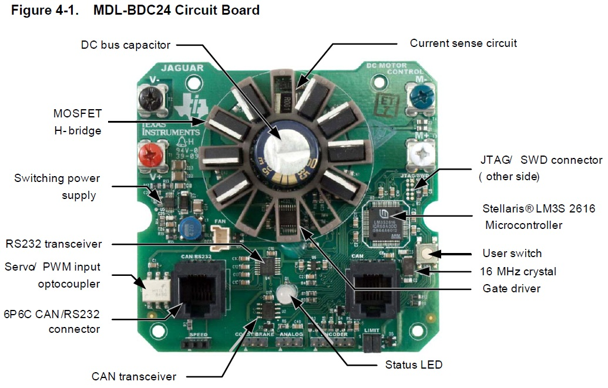

 

## Texas Instruments MDL-BDC24 Black Jaguar (FRC)

 

### Documentation

* [Product Brief (Rev A)](./manuals/mdl-bdc24-product-brief-rev-a.pdf)
* [Datasheet (Rev C)](./manuals/mdl-bdc24-datasheet-rev-c.pdf)
* [Getting Started Guide](./manuals/mdl-bdc24-getting-started-guide.pdf)
* [Users Manual](./manuals/mdl-bdc24-users-manual.pdf)

 

### Schematics

* [Embedded Controller, RS-232, CAN](./internals/mdl-bdc24-full-schematic-1.png)
* [Power Supply and H-Bridge](./internals/mdl-bdc24-full-schematic-2.png)