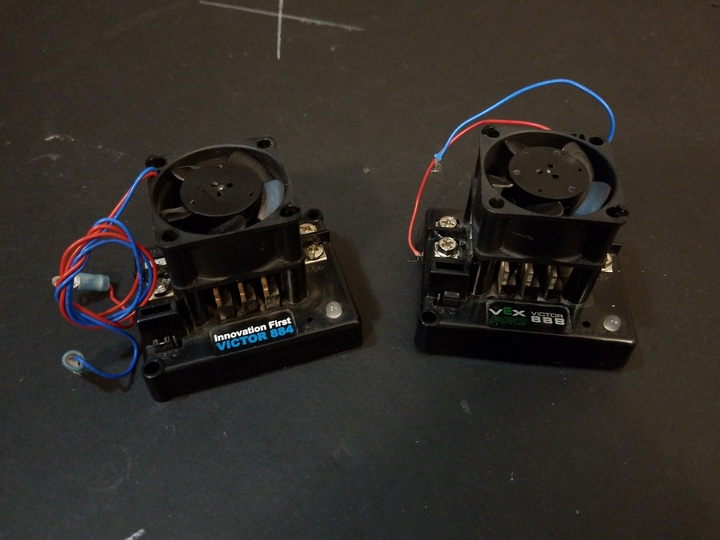

 

## Victor-884 and 888 (FRC)

 

The Victor-884 and 888 controllers are closer to ruggedized RC ESC controllers, and can't be daisy-chained. Less intelligence, but easier to configure.

* [IFI Victor-884 Users Manual](./manuals/IFI-Victor-884-Users-Manual.pdf)
* [VexPro Victor-888 User Manual](./manuals/VexPro-Victor-888-User-Manual.pdf)

Like the Jaguar controllers, these are now discontinued, but can also be found sold on the secondary market.