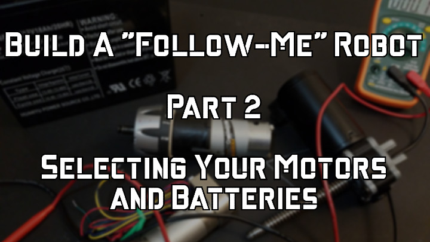

 

Check out the latest on this project and other tutorials at the [Junkbotix Channel](https://www.youtube.com/channel/UCNxQ47xBEYjD-mey_lxj9Aw) on Youtube!

 

## Selecting Your Motors and Batteries

When selecting motors and batteries for your "follow-me" robot, you need to keep in mind what your robot is going to be used for, how big it will be, and how long you'll want it to follow you for. 

All of these factors, and a few others, need to be carefully thought about in order to acheive a successful outcome.

 

## Selecting Motors

The larger (and heavier) the robot, the larger the motors have to be! Usually, that also means you need larger batteries, to have a reasonable run-time (that is, how long the robot will be able to operate before needing recharging).

Unfortunately, you can get into a feedback spiral where you find you need larger motors to move more weight, and larger batteries to run longer, which add weight, and so forth...

Be careful to avoid this!

Your motors will usually need to be gear motors, and brushed DC gear motors are the easiest to work with. But by all means, if you want to try brushless motors (BLDC), or stepper motors, go for it!

Even so - you'll likely need some kind of "gearing down" to increase the amount of torque the motor can apply, and decrease the shaft speed of the motor.

1. If you're using 6-7" diameter wheels, your final output speed needs to be about 180 RPM, to approximate the speed of a person walking. This final RPM can be acheived using a speed controller and/or gearing, but will likely require a combination of both.
2. If your wheels are larger or smaller than this diameter, then you'll also need to adjust things for torque, speed, and motor size. Usually, larger wheels need larger motors (or at least motors with more torque).
3. Also, note the kind of surfaces you'll be using your robot on: Hard and smooth surfaces, like tile or low-pile carpeting, require less torque to move around on than, say, a sandy beach or a gravel covered lot.
4. Be sure to have an idea of the stall current of your motors; this is important not just for selecting batteries (see below), but also when selecting and designing your motor control system. It's the "worse case" scenario, and it's better to be "over" than "under" on the estimate. When in doubt, add 50%!

 

## How to determine the RPM?

I didn't cover this in the video, but there are a few ways to get an idea of the output RPM of your motors:

### Tachometer
Use a low-cost handheld non-contact tachometer - put a piece of white or reflective tape on the output shaft, hook it up, and take a reading. Really the best and easiest way.

### Eyeball it! 

This will really only work with the output of a gear motor, as a standalone motor will rotate too fast. Also - it's not super-accurate, but should give you an idea. 

Let's say you have a 12 volt DC gear motor with an unknown speed. Put a dot or something on the end of the shaft, and apply a fraction of the voltage to it, whatever will get it turning. 

Let's say that was 2 volts. It will rotate slower, so measure how many full rotations it will do in 10 seconds. Let's say it did 5. So that would be 30 RPM, right? 

Well, usually when you increase the voltage, the speed increase is fairly linear...so at 2 volts, it's rotating at 1/6 the RPM it would have at 12 volts. 

Multiply the RPM you got by 6, and you get 180 RPM.

### Video it! 

This is theoretical...I haven't tried it yet, but the idea seems sound enough. Only for a gear motor, again.

Basically, put that dot on the end of the shaft, or affix a pointer, or something. Apply the full voltage to the motor, and use a digital video camera that you can set to a specific number of frames-per-second (the higher the better, but even 30 FPS will work ok) to film the pointer rotating. Take 10 or so seconds of video.

Take the resulting file, and load it into a video editor. I'm most familiar with OpenShot (its what I do my videos with). When you load a 30 FPS clip, the timeline is divided into 30 units per second of video. So if the video clip is marked as 01:17:12 in length, it means "1 minute, 17 seconds, and 12/30s of a second"...

Advance the pointer on the timeline until the motor shaft mark/pointer is vertical (12 o'clock). Note the timestamp. Let's say that's at "00:10:05".

Now, advance the pointer on the timeline until the mark on the shaft makes one complete revolution. Let's say that happens at "00:10:25".

That means it took 2/3s of a second (25 - 5 = 20/30 = 2/3) to make one rotation. There are 180 thirds in 1 minute (3/3 per second * 60 seconds). Mutiple 180 * 2/3...and you get 90 RPM.

Note that at a certain speed (exercise for the reader!) 30 frames-per-second will be too slow to capture an unambiguous full-rotation (minimum of 3 points needed - and that's pushing it)...

You could then count the number of rotations in say, 10 seconds, or 5 seconds, or whatever. Or you could slow it down (lower the voltage). Or you can increase the frames-per-second (if you have some kind of high-speed shutter camera, that would work great).

### Phototransistor?

You could get some kind of phototransistor/LED pair (slot detector, or side-looking detector) and hook it up. Put something on the motor shaft to pass by the slot or whatnot.

If you have an oscilloscope, then you could feed the output signal into it, set your timebase, run the motor, and look at the waveform. 

Or hook it up to an Arduino or something, and have it count the number of times it passes, over the course of 10 seconds or so, then output the results.

 

## Selecting Batteries

I mention in the video about the kinds of batteries you can find out there:

* NiCd / NiMh / LiPo RC packs - usually best for small robots, and typically will only have 10,000 mAh (10 Ah) of capacity, but there are exceptions.
* SLA - Sealed Lead Acid - a staple for larger robots, but for larger capacities (> 10 Ah), they can be fairly heavy.
* Lithium chemistry batteries - LiPo / LiFePo - exist that are drop-in replacements for common sized SLA batteries. They are much, much lighter - but carry a hefty premium in price.

But regardless of what kind of battery you choose, you will want to know and understand how to calculate your runtime - how long your robot will operate before it needs to be recharged.

 

## Calculating Run-Time

Let's say your motors, and entire robot, use only 5 amps of current when running, on average. How long will your robot operate if you have a 5000 mAh RC battery?

If you answered 1 hour - you are correct!

Because 5000 mAh (milliamp-hours) = 5 Ah (amp-hours), drawing 5 amps will only allow power for one hour.

But say your robot used 10 amps of current? How long would it run for on the same battery?

If you answered 30 minutes - again, correct!

Because it now takes double the amount of current (and assuming the battery can supply it - this is called a "C" rating - so the battery would have to be rated at "2C" in order for this to be true - if the battery was only rated "1C", you'll have problems), you'll only get half of the run-time.

Note that, depending on the battery management system (BMS) and such on any given lithium chemistry battery, you can sometimes pull a hundred or more amps from it, but only for a brief period, and only if it is designed for it!

Now - say you could reduce the amount of current your robot uses to only 2.5 amps...how long would it run this time?

If you answered 2 hours - congratulations again! I'm sure you can figure out why.

This is why it's important to know the maximum current rating of your motors, so you can pick the right batteries with the right ratings. Since the motors and other actuators in a robot will usually be the most "current hungry", selecting the battery based on the "worst case" scenario isn't a bad way to go about things.

Now - don't go too far overboard. For instance, if you have two motors, and they each draw 10 amps when stalled, don't think you absolutely need a 20 amp-hour battery. You could probably use a much smaller battery (say something 7-10 amp-hours) and get more than enough run-time. 

It's just a good metric to estimate things by.

Now - is there a way to do this more...scientifically? Well, yes, but it is anything but easy, and involves a lot of design, calculation, and in-depth understanding of exactly what you are building (how much does it weigh, exact surface operating conditions, operating temperature range, whole-system average amperage usage, etc). It is well outside the scope of what Junkbotix is about...but it definitely could be done.