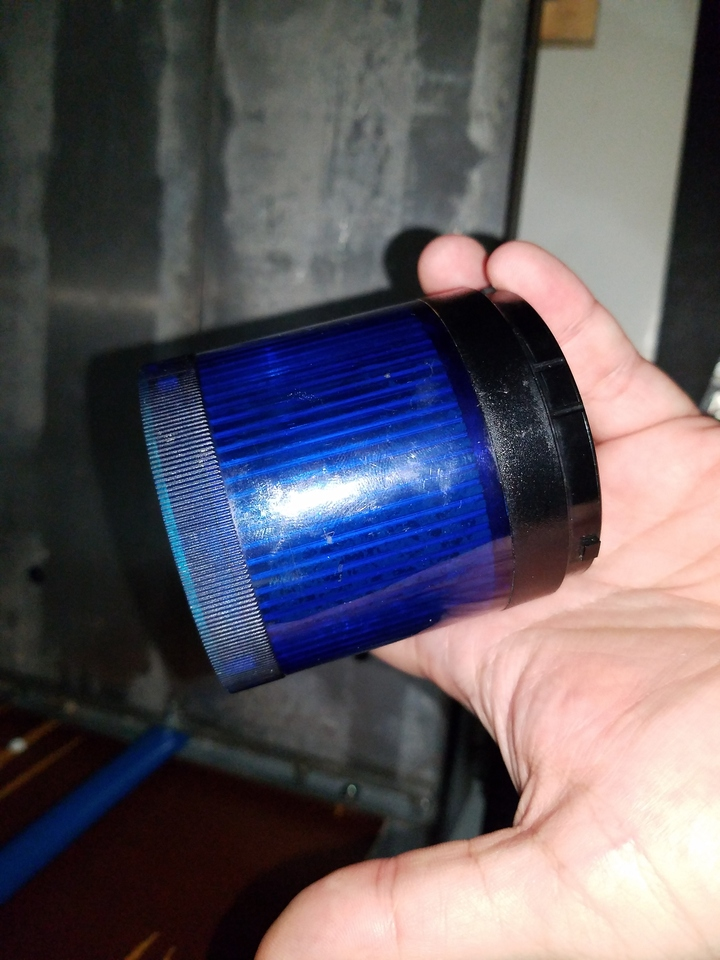
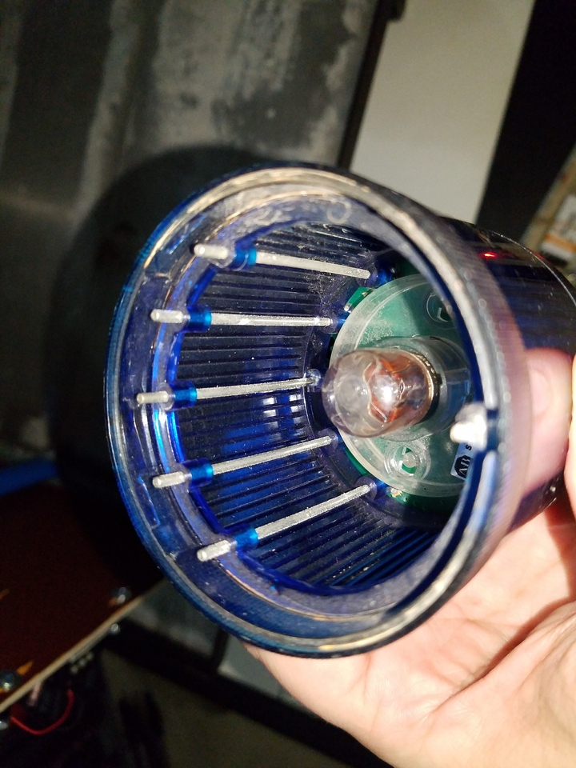

 

Check out the latest on this project and other tutorials at the [Junkbotix Channel](https://www.youtube.com/channel/UCNxQ47xBEYjD-mey_lxj9Aw) on Youtube!

 

## Visual and Audible Safety Beacons

I decided to add both types of beacons to my robot chassis due to its size and weight, plus the fact that it isn't really in the line of sight of most people. The robot can use such beacons for safety, such as for alert others for when it is about to move. It also can use them as a means for announcing its arrival, or performing other robot-to-human communication tasks.

## The Visual Beacon

I found this beacon lens at my favorite electronics salvage yard. Originally, it was a part of an Allen-Bradley (an industrial automation provider) "stack light" system, meant for process control and other needs.

&nbsp;&nbsp;&nbsp;&nbsp;

Originally it ran on 24 volts AC or DC current, and used an incandescent lamp.

&nbsp;&nbsp;&nbsp;&nbsp;&nbsp;&nbsp;&nbsp;&nbsp;

Note the pins: These are meant to conduct the signals for other lights in the stack. As you can see, there are 6 pins (one pin is common), for a total of 5 potential lights (I think there may have been an audible alert module available as well)...

Running the lamp off 12 volts produced a rather weak glow, so I needed to find something that was 12 volts, ideally using bright white LEDs. Fortunately I managed to find such a replacement.

&nbsp;&nbsp;&nbsp;&nbsp;

The LED bulb is slightly larger, but still fits properly into the base and lens assembly.

## Different Bases?

You might be wondering why I make it seem like it was difficult to get such a lamp - after all, isn't the bulb just a regular 1157 type lamp?

Well...unfortunately, no, it isn't...look as the base, and compare it to an 1156/1157, which are common automotive parts. Note how the pins on the base are arranged. For the bulb I needed, they needed to be "inline" or "orthogonal" across from each other. But on the regular automotive versions, they are staggered vertically.

Such a bulb will not fit the socket in the base I had. I couldn't modify the base, either, because there isn't any way to take it apart (I contact AB about it). Fortunately I was able to find something that would work.

## Audible Beacon

The audible safety beacon is just a simple piezo beeper, with a wide voltage range (6-24 volts).

 

## Control

The beacons are both controlled by transistor switches activated by the on-board ESP32 embedded system. As such, it should be possible to perform different effects with the visible beacon - fading, flashing, steady on, strobing, etc.

For the audible beacon, it is limited to simple, single tone beeps. But I could vary the length of the beeping. Or - I might be able to add a regular piezo speaker, and pulse it to make tones of varying frequency. For right now, though, simple beeping works fine.