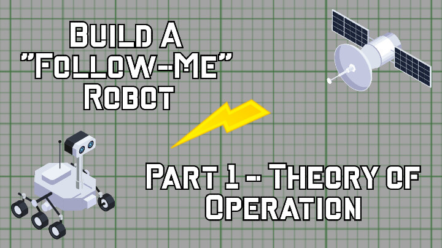

# Build a "Follow-Me" Robot

Check out the latest on this project and tutorial at the [Junkbotix Channel](https://www.youtube.com/channel/UCNxQ47xBEYjD-mey_lxj9Aw) on Youtube!

 

## The Theory of Operation

The method to implement such a robot, at the basic level, is fairly simple:

1. The user of the robot carries a means to identify her current location.
2. The robot also carries a means to identify its location.

   * For our simple implementation, the user and the robot will use GPS receivers as their means of knowing their respective positions. The user's GPS receiver will be their phone. 
   * Idea: The user could also carry a custom device made using an Arduino (or similar embedded device), a GPS module, and some means to communicate wirelessly with the robot, like bluetooth, wifi, nrf2402 modules, etc.

3. The user transmits to the robot (or the robot asks for) her location coordinates.

    * The robot will use bluetooth and/or wifi (in theory, it could also have its own cell phone or similar device) for communicating with the user's phone.

4. The robot compares those coordinates to its own location.

5. If the difference in coordinates deviates by a certain percentage, then the robot knows it needs to move close to the user.

    * GPS, with SA (selective availability) turned off (as it currently is) is usually accurrate to within 1-3 meters of the actual location, so anything greater could be considered the point at which the robot needs to move toward the user.
    * There may also need to be some kind of "low pass filtering" or averaging done to the last 5-10 measurements, to prevent the robot from "hunting" around when it is near the user.

6. The robot picks a heading and accellerates toward the user, stopping when it is no longer "out of range".

 

## Calculations

[This page](https://www.movable-type.co.uk/scripts/latlong.html) is probably one of the best on the subject, covering everything you need to know for finding distances, bearings, etc between geospatial coordinates on Earth.

 

## Calculating the Distance Between the User and the Robot

* Because our needs are simple, and the distances are small, we'll be using the "equirectangular approximation" method for distance calculation.
* If we were needing more accuracy, or doing calculations outside of a few tens of meters or such, we'd probably go with the haversine method.
* Even the haversine method is an approximation, as it assumes the Earth is a sphere. We don't have to worry about this, though...
* Also, maybe something from [here](https://stackoverflow.com/questions/365826/calculate-distance-between-2-gps-coordinates) could be useful...?

 

## Calculating the Heading

* Heading is calculated by ATAN2(delta-y, delta-x)
* A bit of spice from [here](https://stackoverflow.com/questions/2676719/calculating-the-angle-between-the-line-defined-by-two-points), perhaps...?
* Find the angle, compare it to the robot compass reading, then move and turn until it matches (or is close enough)...?
